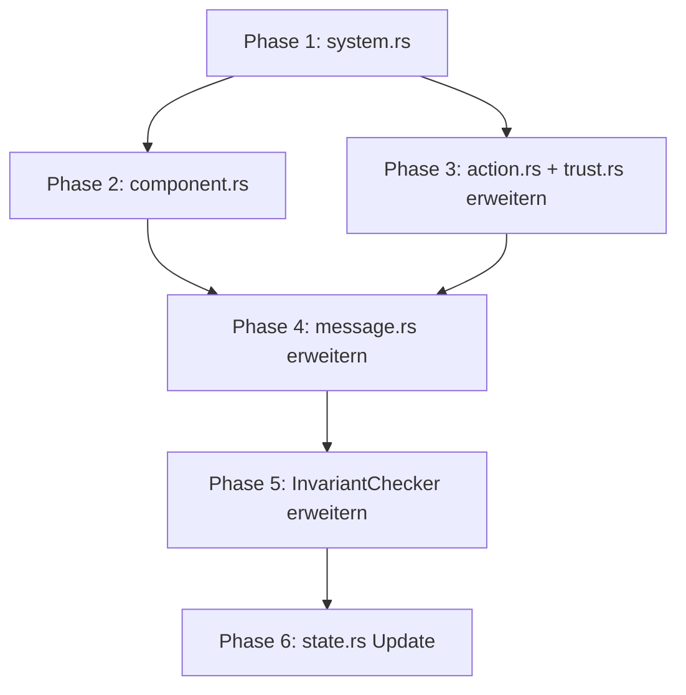

# Domain-Modul Refactoring-Plan

**Basis**: `state.rs` als Referenz-Architektur
**Ziel**: Konsistente, zukunftssichere Domain-Strukturen
**Status**: ✅ Alle 6 Phasen abgeschlossen (Februar 2026)

---

## 0. Implementierungs-Status

| Phase | Beschreibung | Status | Datum |
|-------|--------------|--------|-------|
| 1 | `system.rs` erstellen | ✅ Abgeschlossen | 2026-02-04 |
| 2 | `component.rs` erstellen | ✅ Abgeschlossen | 2026-02-04 |
| 3 | `action.rs` + `trust.rs` erweitern | ✅ Abgeschlossen | 2026-02-04 |
| 4 | `message.rs` erweitern | ✅ Abgeschlossen | 2026-02-04 |
| 5 | InvariantChecker erweitern | ✅ Abgeschlossen | 2026-02-04 |
| 6 | `state.rs` Update | ✅ Abgeschlossen | 2026-02-04 |

### Erstellte Dateien

- `domain/unified/system.rs` - SystemMode, EventPriority, AnomalySeverity
- `domain/unified/component.rs` - StateComponent, ComponentLayer, StateRelation
- `domain/unified/action.rs` - RealmAction, MembershipAction, BlueprintAction, NetworkMetric

### Erweiterte Dateien

- `domain/unified/trust.rs` - TrustUpdateReason um 5 neue Varianten erweitert
- `domain/unified/message.rs` - P2PMessage mit Signatur-Support und EventPriority
- `domain/unified/mod.rs` - Neue Module, Re-Exports, InvariantChecker erweitert
- `domain/mod.rs` - Top-Level Re-Exports aktualisiert
- `core/state.rs` - Lokale Enums entfernt, Re-Exports aus domain hinzugefügt

### Phase 5: InvariantChecker-Erweiterungen

Neue Invarianten-Prüfungen:
- `check_system_mode_transition()` - SystemMode-Übergänge
- `check_operation_allowed_in_mode()` - Operationen pro Modus
- `check_gini_threshold()` - Κ19 Diversity-Prüfung
- `calculate_gini()` - Gini-Koeffizient berechnen
- `check_quota()` - Quota-Limits prüfen
- `check_quota_warning()` - 80% Warnschwelle
- `check_priority_admission()` - Priority-basierte Admission
- `check_priority_ordering()` - Prioritäts-Ordnung

Neue InvariantViolation-Varianten:
- `SystemModeInvalidTransition`
- `OperationNotAllowedInMode`
- `K19GiniExceeded`, `K19InvalidGini`, `K19InvalidThreshold`
- `QuotaExceeded`
- `PriorityRejected`, `PriorityOrderViolation`

### Phase 6: state.rs Migration

- Lokale Enum-Definitionen entfernt (SystemMode, EventPriority, AnomalySeverity, etc.)
- Re-Exports aus `domain/unified` hinzugefügt
- `BlueprintActionType` als Type-Alias für Rückwärtskompatibilität
- StateGraph verwendet jetzt die migrierten Typen

---

## 1. Executive Summary

Das `domain/unified` Modul definiert die Kern-Datenstrukturen für Erynoa. Basierend auf der Analyse von `state.rs` identifiziert dieser Plan Optimierungen und Erweiterungen, um die Domain-Typen vollständig mit dem State-Management zu harmonisieren.

### Aktuelle Struktur (nach Phase 1-4)

```
domain/
├── mod.rs              # Re-exports
└── unified/
    ├── mod.rs          # Modul-Definition + InvariantChecker
    ├── primitives.rs   # UniversalId, TemporalCoord
    ├── system.rs       # SystemMode, EventPriority, AnomalySeverity ← NEU
    ├── component.rs    # StateComponent, ComponentLayer, StateRelation ← NEU
    ├── action.rs       # RealmAction, MembershipAction, BlueprintAction ← NEU
    ├── identity.rs     # DID, DIDDocument, Delegation
    ├── event.rs        # Event, FinalityState, EventPayload
    ├── trust.rs        # TrustVector6D, TrustRecord, TrustUpdateReason ← ERWEITERT
    ├── realm.rs        # Realm, RealmRules, Partition
    ├── saga.rs         # Saga, Intent, SagaAction
    ├── cost.rs         # Cost, Budget, CostTable
    ├── formula.rs      # WorldFormula-Komponenten
    ├── message.rs      # P2P-Nachrichtentypen (Signatur-Support) ← ERWEITERT
    ├── config.rs       # WorldFormulaConfig
    └── schema.rs       # Schema-Migration
```

---

## 2. GAP-Analyse: Domain vs. State.rs

### 2.1 Vorhandene Konsistenz ✓

| Bereich | Domain | State.rs | Status |
|---------|--------|----------|--------|
| UniversalId | `primitives.rs` | Verwendet überall | ✓ Konsistent |
| TemporalCoord | `primitives.rs` | Verwendet überall | ✓ Konsistent |
| TrustVector6D | `trust.rs` | `TrustState` nutzt es | ✓ Konsistent |
| Cost-Algebra | `cost.rs` | `MultiGas`, `ExecutionState` | ✓ Konsistent |
| DID/Delegation | `identity.rs` | `IdentityState` nutzt es | ✓ Konsistent |
| FinalityLevel | `event.rs` | `EventState` nutzt es | ✓ Konsistent |

### 2.2 Identifizierte Gaps ⚠️

| Gap | Domain | State.rs | Priorität |
|-----|--------|----------|-----------|
| **StateEvent-Typen** | Nicht vorhanden | 50+ Event-Varianten | HOCH |
| **SystemMode** | Nicht vorhanden | `Normal/Degraded/Emergency` | HOCH |
| **EventPriority** | Nicht vorhanden | `Critical/High/Normal/Low` | MITTEL |
| **GasLayer** | Nicht vorhanden | `Network/Compute/Storage/Realm` | MITTEL |
| **ResourceType** | Nicht vorhanden | `QueueSlots/StorageBytes/...` | MITTEL |
| **StateComponent** | Nicht vorhanden | 25+ Komponenten | MITTEL |
| **NetworkEvent** | `message.rs` partiell | Vollständig in `state.rs` | MITTEL |
| **TrustReason** | `trust.rs` partiell | Vollständig in `state.rs` | NIEDRIG |
| **AnomalySeverity** | Nicht vorhanden | `Critical/High/Medium/Low` | NIEDRIG |

### 2.3 Fehlende Domain-Typen

Diese Typen sind in `state.rs` definiert, sollten aber nach `domain/unified` migriert werden:

1. **Enums für Event-Sourcing**
   - `StateEvent` (50+ Varianten)
   - `StateComponent` (25+ Komponenten)
   - `DeltaType` (Increment, Snapshot, Insert, ...)

2. **System-Modi**
   - `SystemMode`
   - `EventPriority`
   - `GasLayer`

3. **Quota/Resource-Management**
   - `ResourceType`
   - `QuotaViolation`

4. **Reasons/Actions**
   - `TrustReason` (vollständig)
   - `AnomalySeverity`
   - `RealmAction`
   - `MembershipAction`
   - `BlueprintActionType`

---

## 3. Refactoring-Phasen

### Phase 1: Basis-Enums extrahieren (Priorität: HOCH)

**Ziel**: Wiederverwendbare Enums aus `state.rs` nach `domain/unified` verschieben.

#### 3.1.1 Neue Datei: `unified/system.rs`

```rust
//! System-Modi und Prioritäten

/// System-Betriebsmodus (Circuit Breaker Pattern)
#[derive(Debug, Clone, Copy, PartialEq, Eq, Hash, Serialize, Deserialize, Default)]
#[repr(u8)]
pub enum SystemMode {
    #[default]
    Normal = 0,
    Degraded = 1,
    EmergencyShutdown = 2,
}

impl SystemMode {
    pub fn is_operational(&self) -> bool { ... }
    pub fn allows_execution(&self) -> bool { ... }
    pub fn allows_crossings(&self) -> bool { ... }
}

/// Prioritätsstufe für Events
#[derive(Debug, Clone, Copy, PartialEq, Eq, PartialOrd, Ord, Hash, Serialize, Deserialize)]
pub enum EventPriority {
    Critical = 0,
    High = 1,
    Normal = 2,
    Low = 3,
}

/// Schweregrad einer Anomalie
#[derive(Debug, Clone, Copy, PartialEq, Eq, Hash, Serialize, Deserialize)]
pub enum AnomalySeverity {
    Critical,
    High,
    Medium,
    Low,
}
```

#### 3.1.2 Neue Datei: `unified/resource.rs`

```rust
//! Resource-Typen und Gas-Layer

/// Gas-Layer für hierarchisches Metering
#[derive(Debug, Clone, Copy, PartialEq, Eq, Hash, Serialize, Deserialize)]
pub enum GasLayer {
    Network,
    Compute,
    Storage,
    Realm,
}

impl GasLayer {
    pub fn description(&self) -> &'static str { ... }
    pub fn default_price(&self) -> u64 { ... }
}

/// Resource-Typ für Quota-Tracking
#[derive(Debug, Clone, Copy, PartialEq, Eq, Hash, Serialize, Deserialize)]
pub enum ResourceType {
    QueueSlots,
    StorageBytes,
    ComputeGas,
    Events,
    Crossings,
}

impl ResourceType {
    pub fn default_limit(&self) -> u64 { ... }
}
```

**Aufwand**: 1-2 Stunden
**Risiko**: Niedrig (neue Dateien, keine Änderung an Bestehendem)

---

### Phase 2: StateComponent-Enum extrahieren (Priorität: MITTEL)

**Ziel**: `StateComponent` als zentrale Komponenten-Identifikation in Domain definieren.

#### 3.2.1 Neue Datei: `unified/component.rs`

```rust
//! State-Komponenten-Identifikation

/// State-Komponenten-Identifikator für Event-Sourcing
#[derive(Debug, Clone, Copy, PartialEq, Eq, Hash, Serialize, Deserialize)]
pub enum StateComponent {
    // Core
    Trust,
    Event,
    WorldFormula,
    Consensus,

    // Execution
    Gas,
    Mana,
    Execution,

    // ECLVM
    ECLVM,
    ECLPolicy,
    ECLBlueprint,

    // Protection
    Anomaly,
    Diversity,
    Calibration,

    // Storage
    KVStore,
    EventStore,
    Archive,
    BlueprintStore,

    // Peer
    Gateway,
    SagaComposer,
    IntentParser,
    Realm,

    // P2P
    Swarm,
    DHT,
    Topics,
    Privacy,

    // Identity
    Identity,

    // Engines
    UI,
    API,
    Governance,
    Controller,
}

impl StateComponent {
    pub fn layer(&self) -> ComponentLayer { ... }
    pub fn is_core(&self) -> bool { ... }
    pub fn is_protection(&self) -> bool { ... }
}

pub enum ComponentLayer {
    Identity,
    Core,
    Execution,
    Protection,
    Storage,
    Peer,
    P2P,
    Engine,
}
```

**Aufwand**: 2 Stunden
**Risiko**: Niedrig

---

### Phase 3: Reason/Action-Enums erweitern (Priorität: MITTEL)

**Ziel**: Vollständige Reason/Action-Typen für Auditing und Event-Sourcing.

#### 3.3.1 Erweitern: `unified/trust.rs`

Bestehender `TrustUpdateReason` erweitern:

```rust
/// Grund für Trust-Update (für Audits)
#[derive(Debug, Clone, Serialize, Deserialize)]
pub enum TrustUpdateReason {
    // Bestehend
    DirectInteraction,
    AttestationReceived,
    DelegationCreated,
    DelegationRevoked,
    VouchReceived,
    VouchRevoked,
    PolicyViolation,
    PositiveContribution,
    AnomalyDetected,
    SystemAdjustment,
    DecayOverTime,
    Custom(String),

    // NEU (aus state.rs)
    RealmActivity,
    ConsensusValidation,
    Calibration,
    AdminOverride,
    DisputeResolution,
}
```

#### 3.3.2 Neue Datei: `unified/action.rs`

```rust
//! Lifecycle-Actions für Realms und Memberships

/// Realm-Lifecycle-Aktion
#[derive(Debug, Clone, Copy, PartialEq, Eq, Hash, Serialize, Deserialize)]
pub enum RealmAction {
    Created,
    ConfigChanged,
    Destroyed,
    Paused,
    Resumed,
}

/// Mitgliedschafts-Aktion
#[derive(Debug, Clone, Copy, PartialEq, Eq, Hash, Serialize, Deserialize)]
pub enum MembershipAction {
    Joined,
    Left,
    Banned,
    RoleChanged,
    Invited,
    InviteAccepted,
}

/// Blueprint-Aktion
#[derive(Debug, Clone, Copy, PartialEq, Eq, Hash, Serialize, Deserialize)]
pub enum BlueprintAction {
    Published,
    Deployed,
    Instantiated,
    Verified,
    Deprecated,
}

/// Netzwerk-Metrik-Typ
#[derive(Debug, Clone, Copy, PartialEq, Eq, Hash, Serialize, Deserialize)]
pub enum NetworkMetric {
    ConnectedPeers,
    BytesSent,
    BytesReceived,
    LatencyAvg,
    GossipMessages,
    GossipMessagesReceived,
    DHTLookups,
    PrivacyMessagesSent,
    PrivacyCircuitsCreated,
    CoverTrafficMessages,
    TransportFallbacks,
}
```

**Aufwand**: 2-3 Stunden
**Risiko**: Niedrig

---

### Phase 4: NetworkEvent harmonisieren (Priorität: MITTEL)

**Ziel**: `message.rs` mit `NetworkEvent` aus `state.rs` synchronisieren.

#### 3.4.1 Analyse: message.rs vs. state.rs

**Aktuell in message.rs**:
- `P2PMessage`, `MessagePayload`
- Verschiedene spezifische Message-Typen

**In state.rs**:
- `NetworkEvent` mit Signatur-Support
- `EventPriority`
- `peer_universal_id: Option<UniversalId>`

#### 3.4.2 Erweiterung: `unified/message.rs`

```rust
// Neue Felder für P2PMessage (Phase 7 Identity-Integration)
pub struct P2PMessage {
    // Bestehend...

    // NEU: Identity-Integration
    pub sender_universal_id: Option<UniversalId>,
    pub signature: Option<[u8; 64]>,
    pub signature_verified: Option<bool>,
    pub priority: EventPriority,
}

impl P2PMessage {
    /// Verifiziere Signatur mit IdentityResolver
    pub fn verify_signature<R: IdentityResolver + ?Sized>(&mut self, resolver: &R) -> bool {
        // Implementierung analog zu NetworkEvent
    }

    pub fn is_signed(&self) -> bool {
        self.signature.is_some() && self.sender_universal_id.is_some()
    }
}
```

**Aufwand**: 3-4 Stunden
**Risiko**: Mittel (Breaking Change für existierende Nutzer)

---

### Phase 5: InvariantChecker erweitern (Priorität: HOCH)

**Ziel**: Alle state.rs-Invarianten auch in Domain prüfbar machen.

#### 3.5.1 Analyse: Fehlende Invarianten

Aktuell in `unified/mod.rs` implementiert:
- Κ1: Realm-Hierarchie
- Κ4: Asymmetrische Updates
- Κ8: Delegation Trust-Decay
- Κ9: Kausale Ordnung
- Κ10: Finalitäts-Monotonie
- Cost-Algebra

**Fehlend**:
- SystemMode-Transitions
- Quota-Verletzungen
- Gas-Layer-Konsistenz
- Event-Priority-Ordering

#### 3.5.2 Erweiterung: `unified/mod.rs`

```rust
impl InvariantChecker {
    // BESTEHEND...

    // NEU: SystemMode-Prüfungen

    /// Prüfe gültige SystemMode-Transition
    pub fn check_system_mode_transition(
        old: SystemMode,
        new: SystemMode,
    ) -> Result<(), InvariantViolation> {
        // Normal → Degraded: OK
        // Normal → Emergency: OK
        // Degraded → Emergency: OK
        // Degraded → Normal: OK (Recovery)
        // Emergency → Normal: Nur mit Admin-Reset
        match (old, new) {
            (SystemMode::EmergencyShutdown, SystemMode::Normal) => {
                // Erfordert explizites Admin-Reset
                Err(InvariantViolation::SystemModeInvalidTransition { from: old, to: new })
            }
            _ => Ok(())
        }
    }

    /// Κ19: Prüfe Gini-Koeffizient gegen Threshold
    pub fn check_gini_threshold(gini: f64, threshold: f64) -> Result<(), InvariantViolation> {
        if gini > threshold {
            return Err(InvariantViolation::K19GiniExceeded { gini, threshold });
        }
        Ok(())
    }

    /// Prüfe Quota-Limits
    pub fn check_quota(
        resource: ResourceType,
        used: u64,
        limit: u64,
    ) -> Result<(), InvariantViolation> {
        if used > limit {
            return Err(InvariantViolation::QuotaExceeded { resource, used, limit });
        }
        Ok(())
    }
}

/// Erweiterte Invarianten-Verletzungen
pub enum InvariantViolation {
    // BESTEHEND...

    // NEU
    SystemModeInvalidTransition { from: SystemMode, to: SystemMode },
    K19GiniExceeded { gini: f64, threshold: f64 },
    QuotaExceeded { resource: ResourceType, used: u64, limit: u64 },
    EventPriorityMismatch { expected: EventPriority, actual: EventPriority },
}
```

**Aufwand**: 4-5 Stunden
**Risiko**: Niedrig (additive Änderungen)

---

### Phase 6: state.rs Update (Priorität: HOCH)

**Ziel**: Nach Migration der Typen `state.rs` auf Domain-Imports umstellen.

#### 3.6.1 Änderungen in state.rs

```rust
// VORHER
pub enum SystemMode { ... }
pub enum EventPriority { ... }
pub enum StateComponent { ... }
// etc.

// NACHHER
pub use crate::domain::unified::system::{SystemMode, EventPriority, AnomalySeverity};
pub use crate::domain::unified::resource::{GasLayer, ResourceType};
pub use crate::domain::unified::component::StateComponent;
pub use crate::domain::unified::action::{RealmAction, MembershipAction, BlueprintAction};
```

#### 3.6.2 Migrationsstrategie

1. Neue Dateien in `domain/unified` erstellen
2. `#[deprecated]` auf alte Definitionen in `state.rs`
3. Re-Exports hinzufügen
4. Schrittweise Nutzung in state.rs umstellen
5. Alte Definitionen entfernen

**Aufwand**: 4-6 Stunden
**Risiko**: Mittel (Koordination zwischen Modulen)

---

## 4. Dateistruktur nach Refactoring

```
domain/
├── mod.rs                 # Re-exports
└── unified/
    ├── mod.rs             # InvariantChecker (erweitert)
    ├── primitives.rs      # UniversalId, TemporalCoord
    ├── identity.rs        # DID, DIDDocument, Delegation
    ├── event.rs           # Event, FinalityState
    ├── trust.rs           # TrustVector6D (TrustUpdateReason erweitert)
    ├── realm.rs           # Realm, RealmRules
    ├── saga.rs            # Saga, Intent
    ├── cost.rs            # Cost, Budget
    ├── formula.rs         # WorldFormula
    ├── message.rs         # P2PMessage (erweitert)
    ├── config.rs          # WorldFormulaConfig
    ├── schema.rs          # Schema-Migration
    │
    │  # NEUE DATEIEN
    ├── system.rs          # SystemMode, EventPriority, AnomalySeverity
    ├── resource.rs        # GasLayer, ResourceType
    ├── component.rs       # StateComponent, ComponentLayer
    └── action.rs          # RealmAction, MembershipAction, BlueprintAction, NetworkMetric
```

---

## 5. Migrations-Reihenfolge



### Zeitplan

| Phase | Beschreibung | Aufwand | Abhängigkeit |
|-------|--------------|---------|--------------|
| 1 | `system.rs` erstellen | 1-2h | Keine |
| 2 | `component.rs` erstellen | 2h | Phase 1 |
| 3 | `action.rs` + `trust.rs` erweitern | 2-3h | Phase 1 |
| 4 | `message.rs` erweitern | 3-4h | Phase 1-3 |
| 5 | `InvariantChecker` erweitern | 4-5h | Phase 1-3 |
| 6 | `state.rs` Update | 4-6h | Phase 1-5 |

**Gesamt-Aufwand**: 16-22 Stunden

---

## 6. Detaillierte Änderungen pro Datei

### 6.1 `unified/mod.rs`

**Änderungen**:
```rust
// NEUE Module einbinden
pub mod action;
pub mod component;
pub mod resource;
pub mod system;

// NEUE Re-exports
pub use action::{BlueprintAction, MembershipAction, NetworkMetric, RealmAction};
pub use component::{ComponentLayer, StateComponent};
pub use resource::{GasLayer, ResourceType};
pub use system::{AnomalySeverity, EventPriority, SystemMode};

// InvariantChecker erweitern (siehe Phase 5)
```

### 6.2 `unified/trust.rs`

**Änderungen**:
```rust
// TrustUpdateReason erweitern
pub enum TrustUpdateReason {
    // Bestehend bleiben unverändert
    DirectInteraction,
    AttestationReceived,
    // ...

    // NEU hinzufügen
    RealmActivity,
    ConsensusValidation,
    Calibration,
    AdminOverride,
    DisputeResolution,
}
```

### 6.3 `unified/message.rs`

**Änderungen**:
```rust
use super::primitives::UniversalId;
use super::system::EventPriority;

pub struct P2PMessage {
    // Bestehende Felder...

    // NEU
    pub sender_universal_id: Option<UniversalId>,
    pub signature: Option<[u8; 64]>,
    pub signature_verified: Option<bool>,
    pub priority: EventPriority,
}

impl P2PMessage {
    // NEU: Signatur-Methoden
    pub fn is_signed(&self) -> bool { ... }
    pub fn verify_signature<R>(&mut self, resolver: &R) -> bool { ... }
    pub fn with_priority(mut self, priority: EventPriority) -> Self { ... }
}
```

### 6.4 `domain/mod.rs`

**Änderungen**:
```rust
// NEUE Re-exports hinzufügen
pub use unified::{
    // Bestehend...

    // NEU
    AnomalySeverity, BlueprintAction, ComponentLayer, EventPriority, GasLayer,
    MembershipAction, NetworkMetric, RealmAction, ResourceType, StateComponent, SystemMode,
};
```

---

## 7. Test-Strategie

### 7.1 Unit-Tests für neue Typen

Jede neue Datei erhält eigene Tests:

```rust
#[cfg(test)]
mod tests {
    use super::*;

    #[test]
    fn test_system_mode_transitions() {
        assert!(SystemMode::Normal.is_operational());
        assert!(SystemMode::Degraded.is_operational());
        assert!(!SystemMode::EmergencyShutdown.is_operational());
    }

    #[test]
    fn test_gas_layer_prices() {
        assert_eq!(GasLayer::Network.default_price(), 1);
        assert_eq!(GasLayer::Storage.default_price(), 100);
    }
}
```

### 7.2 Invariant-Tests

```rust
#[test]
fn test_invariant_gini_threshold() {
    assert!(InvariantChecker::check_gini_threshold(0.5, 0.8).is_ok());
    assert!(InvariantChecker::check_gini_threshold(0.9, 0.8).is_err());
}

#[test]
fn test_invariant_quota() {
    assert!(InvariantChecker::check_quota(ResourceType::Events, 5000, 10000).is_ok());
    assert!(InvariantChecker::check_quota(ResourceType::Events, 15000, 10000).is_err());
}
```

### 7.3 Integration mit state.rs

Nach Phase 6 sicherstellen, dass alle `state.rs` Tests weiterhin bestehen:

```bash
cargo test --lib -p erynoa-api state::
```

---

## 8. Risiken und Mitigationen

| Risiko | Wahrscheinlichkeit | Impact | Mitigation |
|--------|-------------------|--------|------------|
| Breaking Changes für API-Nutzer | Mittel | Hoch | `#[deprecated]` + Migration Guide |
| Zirkuläre Abhängigkeiten | Niedrig | Hoch | Saubere Modul-Hierarchie |
| Performance-Regression | Niedrig | Mittel | Benchmarks vor/nach |
| Unvollständige Migration | Mittel | Mittel | Checkliste pro Phase |

---

## 9. Erfolgs-Kriterien

- [ ] Alle neuen Typen in `domain/unified` definiert
- [ ] `state.rs` importiert Typen aus Domain (keine Duplikation)
- [ ] Alle Unit-Tests grün
- [ ] Keine neuen Linter-Warnungen
- [ ] InvariantChecker um 5+ neue Prüfungen erweitert
- [ ] Dokumentation aktualisiert

---

## 10. Nächste Schritte

1. **Review** dieses Plans mit Team
2. **Branch** erstellen: `refactor/domain-state-alignment`
3. **Phase 1** starten: `system.rs` erstellen
4. **Iterativ** durch Phasen 2-6
5. **PR** mit vollständiger Testsuite

---

## Anhang A: Vollständige Typ-Liste aus state.rs

Folgende Typen sollten nach Domain migriert werden:

### Enums
- `SystemMode`
- `EventPriority`
- `DeltaType`
- `StateComponent`
- `StateRelation`
- `GasLayer`
- `ResourceType`
- `TrustReason` (erweitern)
- `AnomalySeverity`
- `MemberRole` (bereits vorhanden)
- `BlueprintActionType`
- `RealmAction`
- `MembershipAction`
- `NetworkMetric`
- `ECLPolicyType`

### Structs (bleiben in state.rs)
Die folgenden bleiben in `state.rs`, da sie Runtime-State sind:
- `UnifiedState`
- `CoreState`
- `IdentityState`
- `ExecutionState`
- `ProtectionState`
- `StorageState`
- `PeerState`
- `P2PState`
- `EventBus`
- `CircuitBreaker`
- `StateEventLog`
- `MerkleStateTracker`
- `MultiGas`
- `RealmQuota`

---

## Anhang B: Compile-Time Size Checks

Nach Migration sicherstellen:

```rust
const _: () = {
    // Bestehende Checks
    assert!(std::mem::size_of::<UniversalId>() == 32);
    assert!(std::mem::size_of::<TemporalCoord>() == 16);
    assert!(std::mem::size_of::<TrustVector6D>() == 24);
    assert!(std::mem::size_of::<Cost>() == 24);

    // Neue Checks
    assert!(std::mem::size_of::<SystemMode>() == 1);
    assert!(std::mem::size_of::<EventPriority>() == 1);
    assert!(std::mem::size_of::<GasLayer>() == 1);
    assert!(std::mem::size_of::<StateComponent>() <= 2);
};
```
