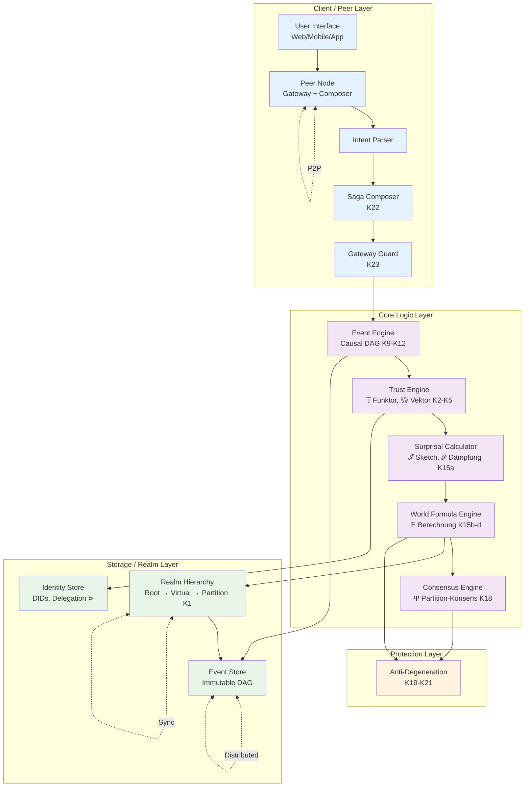

# Erynoa System-Architektur V4.1

> **Version:** 4.1 – Axiom-Abgeleitete Implementierbare Architektur
> **Datum:** Januar 2026
> **Status:** Referenz-Architektur
> **Basis:** LOGIC.md V4.1 (28 Kern-Axiome + 4 Unter-Axiome)
> **Paradigma:** Dezentral, Skalierbar, Human-Aligned

---

## Präambel: Architektur-Prinzipien

Diese Systemarchitektur ist **direkt aus den Axiomen abgeleitet**:

| Axiom                 | Architektur-Implikation                |
| --------------------- | -------------------------------------- |
| Κ1 (Regelvererbung)   | Hierarchische Realm-Struktur           |
| Κ2-Κ5 (Trust-Algebra) | Trust Engine mit 6D-Vektor             |
| Κ9-Κ10 (Kausalität)   | Event-DAG als Kerndatenstruktur        |
| Κ15a-d (Weltformel)   | Surprisal Calculator + Approximationen |
| Κ18 (Konsens)         | Partition-Konsens Engine               |
| Κ19-Κ21 (Schutz)      | Protection Layer                       |
| Κ22-Κ24 (Peer-Logik)  | Gateway + Composer Pattern             |

**Kernziele:**

- **Dezentral**: Kein Single Point of Failure (P2P)
- **Skalierbar**: Bis Milliarden Entitäten (durch Κ15d)
- **Human-Aligned**: Verifizierte Menschen haben Ĥ-Bonus
- **Formal Korrekt**: Mathematisch verifizierbare Invarianten

---

## I. Architektur-Übersicht

### 1.1 Schichten-Diagramm

```
╔════════════════════════════════════════════════════════════════════════════════════════════════════════╗
║                                                                                                        ║
║   ERYNOA SYSTEM-ARCHITEKTUR V4.1                                                                      ║
║                                                                                                        ║
║   ═══════════════════════════════════════════════════════════════════════════════════════════════════  ║
║                                                                                                        ║
║   ┌─────────────────────────────────────────────────────────────────────────────────────────────────┐  ║
║   │                              CLIENT / PEER LAYER                                                │  ║
║   │  ┌──────────────┐  ┌──────────────┐  ┌──────────────┐  ┌──────────────┐  ┌──────────────┐      │  ║
║   │  │   User       │  │   Peer       │  │   Intent     │  │    Saga      │  │   Gateway    │      │  ║
║   │  │   Interface  │→→│   Node       │→→│   Parser     │→→│   Composer   │→→│   Guard      │      │  ║
║   │  │   (Web/App)  │  │ (Κ22-Κ24)   │  │              │  │   (Κ22)     │  │   (Κ23)     │      │  ║
║   │  └──────────────┘  └──────────────┘  └──────────────┘  └──────────────┘  └──────────────┘      │  ║
║   └─────────────────────────────────────────────────────────────────────────────────────────────────┘  ║
║                                              │                                                         ║
║                                              ▼                                                         ║
║   ┌─────────────────────────────────────────────────────────────────────────────────────────────────┐  ║
║   │                              CORE LOGIC LAYER                                                   │  ║
║   │  ┌──────────────┐  ┌──────────────┐  ┌──────────────┐  ┌──────────────┐  ┌──────────────┐      │  ║
║   │  │   Event      │  │   Trust      │  │  Surprisal   │  │   World      │  │  Consensus   │      │  ║
║   │  │   Engine     │→→│   Engine     │→→│  Calculator  │→→│   Formula    │→→│   Engine     │      │  ║
║   │  │   (Κ9-Κ12)  │  │   (Κ2-Κ5)   │  │   (Κ15a)    │  │   (Κ15b-d)  │  │   (Κ18)     │      │  ║
║   │  └──────────────┘  └──────────────┘  └──────────────┘  └──────────────┘  └──────────────┘      │  ║
║   └─────────────────────────────────────────────────────────────────────────────────────────────────┘  ║
║                                              │                                                         ║
║                                              ▼                                                         ║
║   ┌─────────────────────────────────────────────────────────────────────────────────────────────────┐  ║
║   │                              STORAGE / REALM LAYER                                              │  ║
║   │  ┌──────────────┐  ┌──────────────┐  ┌──────────────┐  ┌──────────────┐                        │  ║
║   │  │   Event      │  │   Identity   │  │    Realm     │  │   Credential │                        │  ║
║   │  │   Store      │  │   Store      │  │   Hierarchy  │  │   Vault      │                        │  ║
║   │  │   (DAG)      │  │   (DIDs)     │  │   (Κ1)      │  │   (VCs)      │                        │  ║
║   │  └──────────────┘  └──────────────┘  └──────────────┘  └──────────────┘                        │  ║
║   └─────────────────────────────────────────────────────────────────────────────────────────────────┘  ║
║                                              │                                                         ║
║                                              ▼                                                         ║
║   ┌─────────────────────────────────────────────────────────────────────────────────────────────────┐  ║
║   │                              PROTECTION LAYER                                                   │  ║
║   │  ┌──────────────┐  ┌──────────────┐  ┌──────────────┐  ┌──────────────┐                        │  ║
║   │  │   Anti-      │  │   Diversity  │  │   Quadratic  │  │   Anomaly    │                        │  ║
║   │  │ Calcification│  │   Monitor    │  │   Governance │  │   Detector   │                        │  ║
║   │  │   (Κ19)     │  │   (Κ20)     │  │   (Κ21)     │  │   (V-Dim)    │                        │  ║
║   │  └──────────────┘  └──────────────┘  └──────────────┘  └──────────────┘                        │  ║
║   └─────────────────────────────────────────────────────────────────────────────────────────────────┘  ║
║                                                                                                        ║
║   ═══════════════════════════════════════════════════════════════════════════════════════════════════  ║
║                                                                                                        ║
║   CROSS-CUTTING CONCERNS:                                                                             ║
║   ┌──────────────┐  ┌──────────────┐  ┌──────────────┐  ┌──────────────┐  ┌──────────────┐          ║
║   │   Crypto     │  │   P2P        │  │   Telemetry  │  │   Config     │  │   ECLVM      │          ║
║   │   (Ed25519)  │  │   (Libp2p)   │  │   (Metrics)  │  │   (TOML)     │  │   (Logic)    │          ║
║   └──────────────┘  └──────────────┘  └──────────────┘  └──────────────┘  └──────────────┘          ║
║                                                                                                        ║
╚════════════════════════════════════════════════════════════════════════════════════════════════════════╝
```

### 1.2 Mermaid-Diagramm (Interaktiv)



---

## II. Client / Peer Layer

### 2.1 Peer Node (Κ22-Κ24)

```
╔════════════════════════════════════════════════════════════════════════════════════════════════════════╗
║                                                                                                        ║
║   PEER NODE ARCHITEKTUR                                                                               ║
║                                                                                                        ║
║   ═══════════════════════════════════════════════════════════════════════════════════════════════════  ║
║                                                                                                        ║
║   Jeder Nutzer betreibt einen Peer Node – die fundamentale Einheit der Dezentralisierung.            ║
║                                                                                                        ║
║   ┌─────────────────────────────────────────────────────────────────────────────────────────────────┐  ║
║   │                                    PEER NODE                                                    │  ║
║   │                                                                                                 │  ║
║   │   ┌───────────────────┐    ┌───────────────────┐    ┌───────────────────┐                      │  ║
║   │   │   INTENT PARSER   │    │   SAGA COMPOSER   │    │   GATEWAY GUARD   │                      │  ║
║   │   │                   │    │                   │    │                   │                      │  ║
║   │   │ • NL → Struktur   │───▶│ • Rückwärts-Aufl. │───▶│ • Rule Evaluation │                      │  ║
║   │   │ • Goal Extraction │    │ • Dependency Graph│    │ • Trust Dämpfung  │                      │  ║
║   │   │ • Budget Parsing  │    │ • Topo-Sort       │    │ • Realm Crossing  │                      │  ║
║   │   │                   │    │                   │    │                   │                      │  ║
║   │   └───────────────────┘    └───────────────────┘    └───────────────────┘                      │  ║
║   │                                                                                                 │  ║
║   │   ┌───────────────────────────────────────────────────────────────────────────────────────────┐│  ║
║   │   │                              LOCAL STATE                                                  ││  ║
║   │   │  • Own DID + Keys         • Cached Trust Vectors      • Pending Sagas                    ││  ║
║   │   │  • Delegation Tree        • Recent Events             • Subscription List                ││  ║
║   │   └───────────────────────────────────────────────────────────────────────────────────────────┘│  ║
║   │                                                                                                 │  ║
║   │   ┌───────────────────────────────────────────────────────────────────────────────────────────┐│  ║
║   │   │                              P2P INTERFACE                                                ││  ║
║   │   │  • Libp2p Transport       • Gossip Protocol           • DHT Lookup                       ││  ║
║   │   │  • Multiplexing           • NAT Traversal             • Peer Discovery                   ││  ║
║   │   └───────────────────────────────────────────────────────────────────────────────────────────┘│  ║
║   │                                                                                                 │  ║
║   └─────────────────────────────────────────────────────────────────────────────────────────────────┘  ║
║                                                                                                        ║
╚════════════════════════════════════════════════════════════════════════════════════════════════════════╝
```

### 2.2 Intent Parser

```rust
// Pseudo-Rust für Intent Parsing

/// Ein Intent repräsentiert eine Nutzer-Absicht
pub struct Intent {
    pub goal: Goal,
    pub constraints: Vec<Constraint>,
    pub budget: Budget,
    pub source_did: DID,
    pub context: RealmContext,
}

/// Goals sind typisiert
pub enum Goal {
    Transfer { to: DID, amount: Value, asset: AssetType },
    Attest { claim: Claim, subject: DID },
    Delegate { capability: Capability, to: DID, ttl: Duration },
    Query { predicate: Predicate },
    Create { entity_type: EntityType, params: Params },
}

/// Parser-Funktion (Κ22: ∀ Intent I : ∃! Saga S)
pub fn parse_intent(raw: &str, ctx: &Context) -> Result<Intent, ParseError> {
    let tokens = tokenize(raw)?;
    let goal = extract_goal(&tokens)?;
    let constraints = extract_constraints(&tokens)?;
    let budget = extract_budget(&tokens, ctx.default_budget)?;

    Ok(Intent { goal, constraints, budget, source_did: ctx.did.clone(), context: ctx.realm.clone() })
}
```

### 2.3 Saga Composer (Κ22)

```
╔════════════════════════════════════════════════════════════════════════════════════════════════════════╗
║                                                                                                        ║
║   SAGA COMPOSER ALGORITHMUS (Rückwärts-Auflösung)                                                     ║
║                                                                                                        ║
║   ═══════════════════════════════════════════════════════════════════════════════════════════════════  ║
║                                                                                                        ║
║   INPUT:  Intent I mit Goal G                                                                         ║
║   OUTPUT: Saga S = [Step₁, Step₂, ..., Stepₙ] in topologischer Reihenfolge                           ║
║                                                                                                        ║
║   ALGORITHMUS:                                                                                        ║
║                                                                                                        ║
║   1. GOAL DECOMPOSITION                                                                               ║
║      ─────────────────────                                                                            ║
║      required_resources = analyze_dependencies(G)                                                     ║
║      // z.B. Transfer(100 ERY) → [check_balance, lock_funds, execute, unlock]                        ║
║                                                                                                        ║
║   2. RESOURCE SOURCING                                                                                ║
║      ─────────────────────                                                                            ║
║      for each resource in required_resources:                                                         ║
║          source = find_source(resource, budget, trust_threshold)                                      ║
║          if source.realm ≠ current_realm:                                                             ║
║              add_realm_crossing(source.realm, current_realm)                                          ║
║                                                                                                        ║
║   3. DEPENDENCY GRAPH                                                                                 ║
║      ─────────────────────                                                                            ║
║      G = build_graph(steps, dependencies)                                                             ║
║      // DAG mit Steps als Knoten, Abhängigkeiten als Kanten                                          ║
║                                                                                                        ║
║   4. TOPOLOGICAL SORT                                                                                 ║
║      ─────────────────────                                                                            ║
║      execution_order = topo_sort(G)                                                                   ║
║      // Kahn's Algorithm oder DFS-basiert                                                             ║
║                                                                                                        ║
║   5. SAGA CONSTRUCTION                                                                                ║
║      ─────────────────────                                                                            ║
║      S = Saga {                                                                                       ║
║          steps: execution_order,                                                                      ║
║          compensations: generate_compensations(steps),  // Für Rollback                              ║
║          timeout: calculate_timeout(steps),                                                           ║
║          atomicity: AtomicityLevel::Saga,  // Κ14                                                    ║
║      }                                                                                                ║
║                                                                                                        ║
║   ═══════════════════════════════════════════════════════════════════════════════════════════════════  ║
║                                                                                                        ║
║   BEISPIEL:                                                                                           ║
║                                                                                                        ║
║   Intent: "Kaufe 10 ERY Wissen von did:erynoa:self:alice"                                            ║
║                                                                                                        ║
║   Saga:                                                                                               ║
║       Step 1: verify_identity(self)                                                                   ║
║       Step 2: check_balance(self, 10 ERY)                                                            ║
║       Step 3: query_offer(alice, knowledge_type)                                                      ║
║       Step 4: lock_funds(self, 10 ERY)                        ─┐                                      ║
║       Step 5: lock_knowledge(alice, knowledge_id)              │ Atomic (Κ14)                        ║
║       Step 6: execute_swap(self ↔ alice)                       │                                      ║
║       Step 7: finalize(create_events)                         ─┘                                      ║
║                                                                                                        ║
╚════════════════════════════════════════════════════════════════════════════════════════════════════════╝
```

### 2.4 Gateway Guard (Κ23)

```rust
/// Gateway Guard – prüft Realm-Übergänge
pub struct GatewayGuard {
    rules_engine: RulesEngine,
    trust_dampening: TrustDampeningMatrix,
}

impl GatewayGuard {
    /// Κ23: ∀ (src → tgt) ∈ Saga : guard(user, tgt) muss evaluiert werden
    pub fn evaluate(&self, user: &DID, source_realm: &Realm, target_realm: &Realm, saga: &Saga) -> GuardResult {
        // 1. Collect all predicates for target realm
        let predicates = target_realm.get_predicates();

        // 2. Evaluate each predicate
        let results: Vec<bool> = predicates.iter()
            .map(|p| p.evaluate(user, &self.get_trust_vector(user)))
            .collect();

        // 3. Κ23: guard(u, ctx) = ∧ᵢ Predicateᵢ(u.identity, u.trust, ctx.rules)
        let all_pass = results.iter().all(|&r| r);

        if !all_pass {
            return GuardResult::Denied { reason: "Predicate failed" };
        }

        // 4. Κ24: Trust-Dämpfung bei Realm-Crossing
        // 𝕎_target = M_ctx × 𝕎_source mit ‖M_ctx‖ ≤ 1
        let dampened_trust = self.trust_dampening.apply(
            &self.get_trust_vector(user),
            source_realm,
            target_realm
        );

        GuardResult::Allowed { dampened_trust }
    }
}

/// Trust-Dämpfungsmatrix (Κ24)
pub struct TrustDampeningMatrix {
    /// 6x6 Matrix für jede Realm-Kombination
    matrices: HashMap<(RealmId, RealmId), Matrix6x6>,
}

impl TrustDampeningMatrix {
    /// ‖M_ctx‖ ≤ 1 garantiert, dass Trust nicht steigen kann
    pub fn apply(&self, trust: &TrustVector6D, from: &Realm, to: &Realm) -> TrustVector6D {
        let m = self.matrices.get(&(from.id, to.id))
            .unwrap_or(&Matrix6x6::identity());

        // Κ24: 𝕎_target = M_ctx × 𝕎_source
        m.multiply(trust)
    }
}
```

---

## III. Core Logic Layer

### 3.1 Event Engine (Κ9-Κ12)

```
╔════════════════════════════════════════════════════════════════════════════════════════════════════════╗
║                                                                                                        ║
║   EVENT ENGINE – KAUSALER DAG                                                                         ║
║                                                                                                        ║
║   ═══════════════════════════════════════════════════════════════════════════════════════════════════  ║
║                                                                                                        ║
║   DATENSTRUKTUR (Κ9: DAG mit ⊲ Relation):                                                             ║
║                                                                                                        ║
║   ┌─────────────────────────────────────────────────────────────────────────────────────────────────┐  ║
║   │                                                                                                 │  ║
║   │                    ┌─────┐                                                                      │  ║
║   │                    │ e₁  │ Genesis                                                              │  ║
║   │                    └──┬──┘                                                                      │  ║
║   │              ┌───────┴───────┐                                                                  │  ║
║   │              ▼               ▼                                                                  │  ║
║   │          ┌─────┐         ┌─────┐                                                                │  ║
║   │          │ e₂  │         │ e₃  │                                                                │  ║
║   │          └──┬──┘         └──┬──┘                                                                │  ║
║   │             │    ┌──────────┘                                                                   │  ║
║   │             ▼    ▼                                                                              │  ║
║   │          ┌─────────┐                                                                            │  ║
║   │          │   e₄    │  (e₂ ⊲ e₄) ∧ (e₃ ⊲ e₄)                                                    │  ║
║   │          └────┬────┘                                                                            │  ║
║   │               ▼                                                                                 │  ║
║   │          ┌─────────┐                                                                            │  ║
║   │          │   e₅    │  Newest (NASCENT)                                                          │  ║
║   │          └─────────┘                                                                            │  ║
║   │                                                                                                 │  ║
║   └─────────────────────────────────────────────────────────────────────────────────────────────────┘  ║
║                                                                                                        ║
║   ═══════════════════════════════════════════════════════════════════════════════════════════════════  ║
║                                                                                                        ║
║   EVENT STRUKTUR:                                                                                     ║
║                                                                                                        ║
║   struct Event {                                                                                      ║
║       id: EventId,                    // Hash(content + parents)                                      ║
║       parents: Vec<EventId>,          // Kausale Vorgänger (⊲)                                       ║
║       author: DID,                    // Ersteller                                                    ║
║       timestamp: Timestamp,           // Logische Uhr                                                 ║
║       payload: EventPayload,          // Inhalt                                                       ║
║       signature: Signature,           // Ed25519                                                      ║
║       finality: FinalityLevel,        // NASCENT → ETERNAL                                           ║
║   }                                                                                                   ║
║                                                                                                        ║
║   ═══════════════════════════════════════════════════════════════════════════════════════════════════  ║
║                                                                                                        ║
║   FINALITÄTS-SPEKTRUM (Κ10):                                                                          ║
║                                                                                                        ║
║       NASCENT     ──▶  VALIDATED   ──▶  WITNESSED   ──▶  ANCHORED   ──▶  ETERNAL                     ║
║       (0.5)            (0.9)            (0.99)           (0.999)         (1 - 10⁻⁵⁰)                 ║
║                                                                                                        ║
║       Transition-Bedingungen:                                                                         ║
║       • NASCENT → VALIDATED:    Signature valid + Parents exist                                       ║
║       • VALIDATED → WITNESSED:  n Witnesses mit Trust ≥ θ                                            ║
║       • WITNESSED → ANCHORED:   Merkle-Root in externem System                                        ║
║       • ANCHORED → ETERNAL:     k Bestätigungen auf Anchor-Chain                                     ║
║                                                                                                        ║
╚════════════════════════════════════════════════════════════════════════════════════════════════════════╝
```

```rust
/// Event Engine Implementation
pub struct EventEngine {
    dag: CausalDAG,
    finality_tracker: FinalityTracker,
    witnesses: WitnessPool,
}

impl EventEngine {
    /// Κ12: ∀Π : Π → Δ|ℂ| ≥ 1
    /// Jeder bezeugte Prozess erzeugt mindestens ein Event
    pub fn create_event(&mut self, process: &Process, author: &DID) -> Result<Event, EventError> {
        // 1. Validate process completion
        if !process.is_complete() {
            return Err(EventError::ProcessIncomplete);
        }

        // 2. Find causal parents (latest events this depends on)
        let parents = self.dag.find_causal_parents(&process.dependencies);

        // 3. Create event
        let event = Event {
            id: EventId::new(), // Will be set after hashing
            parents,
            author: author.clone(),
            timestamp: LogicalClock::now(),
            payload: process.to_payload(),
            signature: Signature::pending(),
            finality: FinalityLevel::Nascent,
        };

        // 4. Sign and hash
        let signed_event = event.sign(author)?;
        let final_event = signed_event.with_id(hash(&signed_event));

        // 5. Insert into DAG (Κ9: DAG-Invariante)
        self.dag.insert(final_event.clone())?;

        Ok(final_event)
    }

    /// Κ9: Kausale Ordnung prüfen
    pub fn is_causal_ancestor(&self, ancestor: &EventId, descendant: &EventId) -> bool {
        self.dag.is_ancestor(ancestor, descendant)
    }
}
```

### 3.2 Trust Engine (Κ2-Κ5)

```
╔════════════════════════════════════════════════════════════════════════════════════════════════════════╗
║                                                                                                        ║
║   TRUST ENGINE – 6-DIMENSIONALER VEKTOR                                                               ║
║                                                                                                        ║
║   ═══════════════════════════════════════════════════════════════════════════════════════════════════  ║
║                                                                                                        ║
║   TRUST-VEKTOR 𝕎 ∈ [0,1]⁶ (Κ3):                                                                       ║
║                                                                                                        ║
║                    ┌─────────────────────────────────────────────────────────────┐                    ║
║                    │                                                             │                    ║
║                    │   𝕎(s,ε,t) = (R, I, C, P, V, Ω)                            │                    ║
║                    │                                                             │                    ║
║                    │   R = Reliability    (Verhaltens-Historie)                  │                    ║
║                    │   I = Integrity      (Aussage-Konsistenz)                   │                    ║
║                    │   C = Competence     (Fähigkeits-Nachweis)                  │                    ║
║                    │   P = Prestige       (Externe Attestation)                  │                    ║
║                    │   V = Vigilance      (Anomalie-Erkennung)                   │                    ║
║                    │   Ω = Omega          (Axiom-Treue)                          │                    ║
║                    │                                                             │                    ║
║                    └─────────────────────────────────────────────────────────────┘                    ║
║                                                                                                        ║
║   ═══════════════════════════════════════════════════════════════════════════════════════════════════  ║
║                                                                                                        ║
║   UPDATE-REGELN (Κ4: Asymmetrische Evolution):                                                        ║
║                                                                                                        ║
║       Δ⁺(dim) = base_delta                                                                            ║
║       Δ⁻(dim) = λ_asym · base_delta    wobei λ = 1.5 (R,I,C,P), 2.0 (V,Ω)                            ║
║                                                                                                        ║
║   KOMBINATION (Κ5: Probabilistisch):                                                                  ║
║                                                                                                        ║
║       t₁ ⊕ t₂ = 1 - (1-t₁)(1-t₂)                                                                      ║
║                                                                                                        ║
║   ═══════════════════════════════════════════════════════════════════════════════════════════════════  ║
║                                                                                                        ║
║   KONTEXT-GEWICHTE (Κ15b):                                                                            ║
║                                                                                                        ║
║       Kontext              R      I      C      P      V      Ω                                       ║
║       ─────────────────────────────────────────────────────────                                       ║
║       Finanztransaktion   0.30   0.25   0.15   0.10   0.15   0.05                                     ║
║       Wissensaustausch    0.10   0.30   0.30   0.15   0.10   0.05                                     ║
║       Governance          0.15   0.20   0.15   0.20   0.10   0.20                                     ║
║       Default             0.17   0.17   0.17   0.17   0.16   0.16                                     ║
║                                                                                                        ║
╚════════════════════════════════════════════════════════════════════════════════════════════════════════╝
```

```rust
/// Trust Engine Implementation
pub struct TrustEngine {
    vectors: HashMap<DID, TrustVector6D>,
    context_weights: HashMap<ContextType, [f64; 6]>,
    asymmetry_factors: [f64; 6],  // λ per dimension
}

#[derive(Clone, Debug)]
pub struct TrustVector6D {
    pub r: f64,  // Reliability
    pub i: f64,  // Integrity
    pub c: f64,  // Competence
    pub p: f64,  // Prestige
    pub v: f64,  // Vigilance
    pub omega: f64,  // Omega (Axiom-Treue)
}

impl TrustEngine {
    /// Κ4: Asymmetrische Evolution
    pub fn update(&mut self, did: &DID, event: &TrustEvent) {
        let vector = self.vectors.entry(did.clone()).or_insert(TrustVector6D::default());

        let (dimension, delta, is_positive) = self.analyze_event(event);

        let effective_delta = if is_positive {
            delta
        } else {
            delta * self.asymmetry_factors[dimension as usize]
        };

        vector.update_dimension(dimension, effective_delta, is_positive);
    }

    /// Κ5: Probabilistische Kombination
    pub fn combine(t1: f64, t2: f64) -> f64 {
        1.0 - (1.0 - t1) * (1.0 - t2)
    }

    /// Κ15b: Gewichtete Norm
    pub fn weighted_norm(&self, vector: &TrustVector6D, context: ContextType) -> f64 {
        let weights = self.context_weights.get(&context)
            .unwrap_or(&[0.17, 0.17, 0.17, 0.17, 0.16, 0.16]);

        let sum: f64 = [vector.r, vector.i, vector.c, vector.p, vector.v, vector.omega]
            .iter()
            .zip(weights.iter())
            .map(|(v, w)| w * v * v)
            .sum();

        sum.sqrt()
    }

    /// Τ1: Ketten-Trust
    pub fn chain_trust(chain: &[f64]) -> f64 {
        let n = chain.len() as f64;
        let log_sum: f64 = chain.iter().map(|t| t.ln()).sum();
        (log_sum / n.sqrt()).exp()
    }
}
```

### 3.3 Surprisal Calculator (Κ15a)

```
╔════════════════════════════════════════════════════════════════════════════════════════════════════════╗
║                                                                                                        ║
║   SURPRISAL CALCULATOR – INFORMATIONSTHEORETISCH                                                      ║
║                                                                                                        ║
║   ═══════════════════════════════════════════════════════════════════════════════════════════════════  ║
║                                                                                                        ║
║   SHANNON-SURPRISAL (Κ15a):                                                                           ║
║                                                                                                        ║
║       ℐ(e|s) = −log₂ P(e | ℂ(s))                                                                      ║
║                                                                                                        ║
║   ═══════════════════════════════════════════════════════════════════════════════════════════════════  ║
║                                                                                                        ║
║   SKETCH-BASIERTE APPROXIMATION (O(1) pro Event):                                                     ║
║                                                                                                        ║
║   ┌─────────────────────────────────────────────────────────────────────────────────────────────────┐  ║
║   │                                                                                                 │  ║
║   │   1. EVENT-FINGERPRINTING (MinHash)                                                            │  ║
║   │      ─────────────────────────────                                                             │  ║
║   │      fingerprint(e) = MinHash(                                                                 │  ║
║   │          event_type(e),                                                                        │  ║
║   │          involved_dids(e),                                                                     │  ║
║   │          value_bucket(e)                                                                       │  ║
║   │      )                                                                                         │  ║
║   │                                                                                                 │  ║
║   │   2. FREQUENCY ESTIMATION (Count-Min Sketch)                                                   │  ║
║   │      ─────────────────────────────────────                                                     │  ║
║   │      count ≈ CMS.query(fingerprint(e))                                                        │  ║
║   │                                                                                                 │  ║
║   │   3. PROBABILITY ESTIMATION                                                                    │  ║
║   │      ─────────────────────────────                                                             │  ║
║   │      P(e | ℂ_recent) ≈ count / |ℂ_recent|                                                     │  ║
║   │                                                                                                 │  ║
║   │   4. SURPRISAL                                                                                 │  ║
║   │      ─────────────                                                                             │  ║
║   │      ℐ(e) = −log₂(P(e | ℂ_recent))                                                            │  ║
║   │                                                                                                 │  ║
║   └─────────────────────────────────────────────────────────────────────────────────────────────────┘  ║
║                                                                                                        ║
║   ═══════════════════════════════════════════════════════════════════════════════════════════════════  ║
║                                                                                                        ║
║   TRUST-GEDÄMPFTE SURPRISAL 𝒮 (Anti-Hype):                                                            ║
║                                                                                                        ║
║       𝒮(s) = ‖𝕎(s)‖² · ℐ(s)                                                                          ║
║                                                                                                        ║
║   BEISPIEL:                                                                                           ║
║       Agent mit 𝕎 = 0.3:  𝒮 = 0.09 · ℐ   (91% Dämpfung)                                              ║
║       Agent mit 𝕎 = 0.9:  𝒮 = 0.81 · ℐ   (19% Dämpfung)                                              ║
║                                                                                                        ║
║   → Verhindert: Hype-Zyklen, Spam-Belohnung, Sybil-Novelty-Farming                                   ║
║                                                                                                        ║
╚════════════════════════════════════════════════════════════════════════════════════════════════════════╝
```

```rust
/// Surprisal Calculator Implementation
pub struct SurprisalCalculator {
    count_min_sketch: CountMinSketch,
    minhash: MinHash,
    recent_window: Duration,
    recent_count: AtomicU64,
}

impl SurprisalCalculator {
    /// Κ15a: Shannon-Surprisal
    pub fn calculate_surprisal(&self, event: &Event) -> f64 {
        // 1. Fingerprint the event
        let fingerprint = self.minhash.hash(&EventFeatures::from(event));

        // 2. Query frequency
        let count = self.count_min_sketch.query(&fingerprint) as f64;
        let total = self.recent_count.load(Ordering::Relaxed) as f64;

        // 3. Estimate probability (with Laplace smoothing)
        let probability = (count + 1.0) / (total + 1.0);

        // 4. Calculate surprisal: ℐ = −log₂ P
        -probability.log2()
    }

    /// Trust-gedämpfte Surprisal (Anti-Hype)
    pub fn dampened_surprisal(&self, event: &Event, trust_norm: f64) -> f64 {
        let surprisal = self.calculate_surprisal(event);

        // 𝒮 = ‖𝕎‖² · ℐ
        trust_norm.powi(2) * surprisal
    }

    /// Update sketch with new event
    pub fn observe(&mut self, event: &Event) {
        let fingerprint = self.minhash.hash(&EventFeatures::from(event));
        self.count_min_sketch.insert(&fingerprint);
        self.recent_count.fetch_add(1, Ordering::Relaxed);
    }
}

/// Count-Min Sketch für O(1) Frequency Estimation
pub struct CountMinSketch {
    width: usize,
    depth: usize,
    table: Vec<Vec<u32>>,
    hash_functions: Vec<Box<dyn Fn(&[u8]) -> usize>>,
}

impl CountMinSketch {
    pub fn query(&self, item: &[u8]) -> u32 {
        self.hash_functions.iter()
            .enumerate()
            .map(|(i, h)| self.table[i][h(item) % self.width])
            .min()
            .unwrap_or(0)
    }

    pub fn insert(&mut self, item: &[u8]) {
        for (i, h) in self.hash_functions.iter().enumerate() {
            let idx = h(item) % self.width;
            self.table[i][idx] = self.table[i][idx].saturating_add(1);
        }
    }
}
```

### 3.4 World Formula Engine (Κ15b-d)

```
╔════════════════════════════════════════════════════════════════════════════════════════════════════════╗
║                                                                                                        ║
║   WORLD FORMULA ENGINE – 𝔼 BERECHNUNG                                                                 ║
║                                                                                                        ║
║   ═══════════════════════════════════════════════════════════════════════════════════════════════════  ║
║                                                                                                        ║
║   WELTFORMEL V2.0:                                                                                    ║
║                                                                                                        ║
║       𝔼 = Σ  𝔸(s) · σ⃗( ‖𝕎(s)‖_w · ln|ℂ(s)| · 𝒮(s) ) · Ĥ(s) · w(s,t)                                 ║
║           s∈𝒞                                                                                         ║
║                                                                                                        ║
║   ═══════════════════════════════════════════════════════════════════════════════════════════════════  ║
║                                                                                                        ║
║   APPROXIMATIONS-STRATEGIEN (Κ15d):                                                                   ║
║                                                                                                        ║
║   ┌─────────────────────────────────────────────────────────────────────────────────────────────────┐  ║
║   │                                                                                                 │  ║
║   │   1. HIERARCHISCHE AGGREGATION (für Batch-Analyse)                                             │  ║
║   │      ─────────────────────────────────────────────                                              │  ║
║   │      𝔼 ≈ Σ_partitions 𝔼_partition                                                              │  ║
║   │      𝔼_partition = |partition| · mean(sample(partition, k))                                   │  ║
║   │                                                                                                 │  ║
║   │      Komplexität: O(|Partitions| · k) statt O(|𝒞|)                                             │  ║
║   │                                                                                                 │  ║
║   │   2. STREAMING APPROXIMATION (für Echtzeit)                                                    │  ║
║   │      ─────────────────────────────────────────                                                  │  ║
║   │      𝔼(t+1) = α · 𝔼(t) + (1-α) · Σ_new f(s_new)                                               │  ║
║   │      α = exp(-Δt / τ_update)                                                                   │  ║
║   │                                                                                                 │  ║
║   │      Komplexität: O(|neue Events|) pro Update                                                  │  ║
║   │                                                                                                 │  ║
║   │   3. IMPORTANCE SAMPLING (für statistische Analyse)                                            │  ║
║   │      ─────────────────────────────────────────────                                              │  ║
║   │      𝔼 ≈ (1/k) · Σᵢ f(sᵢ) / q(sᵢ)                                                             │  ║
║   │      wobei sᵢ ~ q(s) ∝ 𝔸(s) · ‖𝕎(s)‖                                                          │  ║
║   │                                                                                                 │  ║
║   │      Minimiert Varianz durch intelligentes Sampling                                            │  ║
║   │                                                                                                 │  ║
║   └─────────────────────────────────────────────────────────────────────────────────────────────────┘  ║
║                                                                                                        ║
╚════════════════════════════════════════════════════════════════════════════════════════════════════════╝
```

```rust
/// World Formula Engine
pub struct WorldFormulaEngine {
    trust_engine: Arc<TrustEngine>,
    surprisal_calc: Arc<SurprisalCalculator>,
    event_engine: Arc<EventEngine>,
    realm_hierarchy: Arc<RealmHierarchy>,

    // Streaming state
    current_e: AtomicF64,
    last_update: AtomicU64,
    tau_update: Duration,
}

impl WorldFormulaEngine {
    /// Berechne Beitrag eines einzelnen Subjects zur Weltformel
    fn compute_contribution(&self, s: &DID, context: ContextType, t: Timestamp) -> f64 {
        // 𝔸(s) - Aktivitäts-Präsenz
        let activity = self.compute_activity(s);

        // ‖𝕎(s)‖_w - Gewichtete Trust-Norm
        let trust_vector = self.trust_engine.get_vector(s);
        let trust_norm = self.trust_engine.weighted_norm(&trust_vector, context);

        // |ℂ(s)| - Größe der kausalen Geschichte
        let causal_history_size = self.event_engine.causal_history_size(s);

        // 𝒮(s) - Trust-gedämpfte Surprisal
        let surprisal = self.surprisal_calc.dampened_surprisal_for_subject(s, trust_norm);

        // Ĥ(s) - Human-Alignment Factor (Κ16)
        let human_factor = self.compute_human_factor(s);

        // w(s,t) - Temporale Gewichtung (Κ17)
        let temporal_weight = self.compute_temporal_weight(s, t);

        // σ⃗ - Sigmoid
        let inner = trust_norm * (causal_history_size as f64).ln() * surprisal;
        let sigmoid = 1.0 / (1.0 + (-inner).exp());

        // Kombination
        activity * sigmoid * human_factor * temporal_weight
    }

    /// Κ16: Human-Alignment Factor
    fn compute_human_factor(&self, s: &DID) -> f64 {
        match self.get_human_status(s) {
            HumanStatus::VerifiedHuman => 2.0,
            HumanStatus::HumanControlled => 1.5,
            HumanStatus::Unknown => 1.0,
        }
    }

    /// Κ17: Temporale Vergebung
    fn compute_temporal_weight(&self, s: &DID, t: Timestamp) -> f64 {
        let events = self.event_engine.get_events_for(s);

        events.iter().map(|e| {
            let age = t - e.timestamp;
            let gamma = if e.is_negative() {
                0.000633  // 3 Jahre Halbwertszeit
            } else {
                0.000380  // 5 Jahre Halbwertszeit
            };
            (-gamma * age.as_days() as f64).exp()
        }).sum::<f64>() / events.len() as f64
    }

    /// Κ15d: Streaming Approximation
    pub fn update_streaming(&self, new_events: &[Event]) {
        let now = Timestamp::now();
        let last = Timestamp::from_millis(self.last_update.load(Ordering::Relaxed));
        let dt = (now - last).as_secs_f64();

        // α = exp(-Δt / τ_update)
        let alpha = (-dt / self.tau_update.as_secs_f64()).exp();

        // Neue Beiträge berechnen
        let new_contribution: f64 = new_events.iter()
            .map(|e| self.compute_contribution(&e.author, ContextType::Default, now))
            .sum();

        // 𝔼(t+1) = α · 𝔼(t) + (1-α) · Σ_new f(s_new)
        let current = self.current_e.load(Ordering::Relaxed);
        let updated = alpha * current + (1.0 - alpha) * new_contribution;

        self.current_e.store(updated, Ordering::Relaxed);
        self.last_update.store(now.as_millis(), Ordering::Relaxed);
    }

    /// Κ15d: Hierarchische Aggregation
    pub fn compute_hierarchical(&self, sample_size: usize) -> f64 {
        self.realm_hierarchy.partitions().iter()
            .map(|partition| {
                let members = partition.members();
                let sample: Vec<_> = members.choose_multiple(&mut rand::thread_rng(), sample_size).collect();

                let sample_mean: f64 = sample.iter()
                    .map(|s| self.compute_contribution(s, ContextType::Default, Timestamp::now()))
                    .sum::<f64>() / sample_size as f64;

                members.len() as f64 * sample_mean
            })
            .sum()
    }
}
```

### 3.5 Consensus Engine (Κ18)

```
╔════════════════════════════════════════════════════════════════════════════════════════════════════════╗
║                                                                                                        ║
║   CONSENSUS ENGINE – PARTITION-KONSENS                                                                ║
║                                                                                                        ║
║   ═══════════════════════════════════════════════════════════════════════════════════════════════════  ║
║                                                                                                        ║
║   Κ18 KONSENS-KONSTITUTION:                                                                           ║
║                                                                                                        ║
║                    Σ 𝕎(s) · [s ⊢ φ]                                                                   ║
║       Ψ(Σ)(φ) = ─────────────────────                                                                 ║
║                      Σ 𝕎(s)                                                                           ║
║                  s ⊢ Σ                                                                                ║
║                                                                                                        ║
║       θ_konsens = 2/3 (Supermajorität)                                                                ║
║                                                                                                        ║
║   ═══════════════════════════════════════════════════════════════════════════════════════════════════  ║
║                                                                                                        ║
║   PROZESS:                                                                                            ║
║                                                                                                        ║
║   ┌─────────────────────────────────────────────────────────────────────────────────────────────────┐  ║
║   │                                                                                                 │  ║
║   │   1. PROPOSAL PHASE                                                                            │  ║
║   │      ─────────────────                                                                          │  ║
║   │      Proposer p broadcasts φ to Partition Σ                                                    │  ║
║   │                                                                                                 │  ║
║   │   2. VOTING PHASE                                                                              │  ║
║   │      ─────────────                                                                              │  ║
║   │      Each member s ∈ Σ:                                                                        │  ║
║   │          vote(s, φ) = { 1 if accepts φ, 0 otherwise }                                          │  ║
║   │          weight(s) = ‖𝕎(s)‖_governance                                                         │  ║
║   │                                                                                                 │  ║
║   │   3. AGGREGATION PHASE                                                                         │  ║
║   │      ─────────────────                                                                          │  ║
║   │      Ψ(Σ)(φ) = Σ weight(s) · vote(s, φ) / Σ weight(s)                                         │  ║
║   │                                                                                                 │  ║
║   │   4. DECISION PHASE                                                                            │  ║
║   │      ───────────────                                                                            │  ║
║   │      if Ψ(Σ)(φ) > θ_konsens:                                                                   │  ║
║   │          φ becomes Partition-Wahrheit                                                          │  ║
║   │          broadcast_decision(φ, ACCEPTED)                                                       │  ║
║   │      else:                                                                                     │  ║
║   │          broadcast_decision(φ, REJECTED)                                                       │  ║
║   │                                                                                                 │  ║
║   └─────────────────────────────────────────────────────────────────────────────────────────────────┘  ║
║                                                                                                        ║
╚════════════════════════════════════════════════════════════════════════════════════════════════════════╝
```

```rust
/// Consensus Engine
pub struct ConsensusEngine {
    trust_engine: Arc<TrustEngine>,
    threshold: f64,  // θ_konsens = 2/3
}

impl ConsensusEngine {
    /// Κ18: Gewichteter Konsens
    pub fn compute_consensus(&self, partition: &Partition, proposal: &Proposal) -> ConsensusResult {
        let mut weighted_sum = 0.0;
        let mut weight_total = 0.0;

        for member in partition.members() {
            let trust = self.trust_engine.get_vector(&member);
            let weight = self.trust_engine.weighted_norm(&trust, ContextType::Governance);

            let vote = member.vote_on(proposal);

            weighted_sum += weight * vote as f64;
            weight_total += weight;
        }

        let psi = weighted_sum / weight_total;

        ConsensusResult {
            value: psi,
            accepted: psi > self.threshold,
            participation: partition.members().len(),
        }
    }
}
```

---

## IV. Storage / Realm Layer

### 4.1 Realm Hierarchy (Κ1)

```
╔════════════════════════════════════════════════════════════════════════════════════════════════════════╗
║                                                                                                        ║
║   REALM HIERARCHY – DREI-EBENEN-ARCHITEKTUR                                                           ║
║                                                                                                        ║
║   ═══════════════════════════════════════════════════════════════════════════════════════════════════  ║
║                                                                                                        ║
║   Κ1: 𝒞_RootRealm ⊃ 𝒞_VirtualRealm ⊃ 𝒞_Partition                                                      ║
║                                                                                                        ║
║   ┌─────────────────────────────────────────────────────────────────────────────────────────────────┐  ║
║   │                                                                                                 │  ║
║   │                            ┌─────────────────────────────────┐                                  │  ║
║   │                            │         ROOT-REALM              │                                  │  ║
║   │                            │   (Universelle Axiome Κ1-Κ28)   │                                  │  ║
║   │                            │   rules: {Κ1, ..., Κ28}         │                                  │  ║
║   │                            └───────────────┬─────────────────┘                                  │  ║
║   │                                            │                                                    │  ║
║   │                    ┌───────────────────────┼───────────────────────┐                            │  ║
║   │                    ▼                       ▼                       ▼                            │  ║
║   │   ┌────────────────────────┐ ┌────────────────────────┐ ┌────────────────────────┐              │  ║
║   │   │    VIRTUAL-REALM A     │ │    VIRTUAL-REALM B     │ │    VIRTUAL-REALM C     │              │  ║
║   │   │   (z.B. "Knowledge")   │ │   (z.B. "Finance")     │ │   (z.B. "Creative")    │              │  ║
║   │   │   rules: {Κ1-28} + {A} │ │   rules: {Κ1-28} + {B} │ │   rules: {Κ1-28} + {C} │              │  ║
║   │   └──────────┬─────────────┘ └──────────┬─────────────┘ └──────────┬─────────────┘              │  ║
║   │              │                          │                          │                            │  ║
║   │       ┌──────┴──────┐            ┌──────┴──────┐            ┌──────┴──────┐                      │  ║
║   │       ▼             ▼            ▼             ▼            ▼             ▼                      │  ║
║   │   ┌───────┐     ┌───────┐   ┌───────┐     ┌───────┐    ┌───────┐     ┌───────┐                  │  ║
║   │   │Part A1│     │Part A2│   │Part B1│     │Part B2│    │Part C1│     │Part C2│                  │  ║
║   │   │Energy │     │Trust  │   │DeFi   │     │Escrow │    │Art    │     │Music  │                  │  ║
║   │   └───────┘     └───────┘   └───────┘     └───────┘    └───────┘     └───────┘                  │  ║
║   │                                                                                                 │  ║
║   └─────────────────────────────────────────────────────────────────────────────────────────────────┘  ║
║                                                                                                        ║
║   ═══════════════════════════════════════════════════════════════════════════════════════════════════  ║
║                                                                                                        ║
║   REGEL-VERERBUNG (Κ1):                                                                               ║
║                                                                                                        ║
║       Regeln(Partition) ⊇ Regeln(VirtualRealm) ⊇ Regeln(RootRealm)                                   ║
║                                                                                                        ║
║       "Kind-Kategorien können Regeln hinzufügen, nie entfernen."                                      ║
║                                                                                                        ║
╚════════════════════════════════════════════════════════════════════════════════════════════════════════╝
```

```rust
/// Realm Hierarchy
pub struct RealmHierarchy {
    root: RootRealm,
    virtual_realms: HashMap<RealmId, VirtualRealm>,
    partitions: HashMap<PartitionId, Partition>,
}

pub struct Realm {
    id: RealmId,
    parent: Option<RealmId>,
    rules: RuleSet,
    members: HashSet<DID>,
}

impl RealmHierarchy {
    /// Κ1: Regelvererbung prüfen
    pub fn validate_rules(&self, partition: &Partition) -> bool {
        let partition_rules = &partition.rules;

        // Find parent virtual realm
        let virtual_realm = self.virtual_realms.get(&partition.parent)
            .expect("Partition must have parent");

        // Check: Partition rules must be superset of virtual realm rules
        virtual_realm.rules.is_subset_of(partition_rules)
            && self.root.rules.is_subset_of(&virtual_realm.rules)
    }

    /// Navigate to a realm
    pub fn resolve_realm(&self, path: &RealmPath) -> Option<&Realm> {
        match path {
            RealmPath::Root => Some(&self.root.as_realm()),
            RealmPath::Virtual(id) => self.virtual_realms.get(id).map(|r| r.as_realm()),
            RealmPath::Partition(id) => self.partitions.get(id).map(|p| p.as_realm()),
        }
    }
}
```

### 4.2 Event Store (Immutable DAG)

```rust
/// Event Store - Immutable Append-Only DAG
pub struct EventStore {
    /// Backend storage (IPFS, local, or hybrid)
    backend: Box<dyn StorageBackend>,

    /// Local index for fast queries
    index: EventIndex,

    /// Merkle roots for anchoring
    merkle_roots: Vec<MerkleRoot>,
}

pub trait StorageBackend: Send + Sync {
    fn put(&self, event: &Event) -> Result<EventId, StorageError>;
    fn get(&self, id: &EventId) -> Result<Option<Event>, StorageError>;
    fn exists(&self, id: &EventId) -> Result<bool, StorageError>;
}

/// IPFS Backend
pub struct IPFSBackend {
    client: IpfsClient,
}

impl StorageBackend for IPFSBackend {
    fn put(&self, event: &Event) -> Result<EventId, StorageError> {
        let cid = self.client.dag_put(event.to_ipld())?;
        Ok(EventId::from_cid(cid))
    }

    fn get(&self, id: &EventId) -> Result<Option<Event>, StorageError> {
        match self.client.dag_get(id.to_cid()) {
            Ok(ipld) => Ok(Some(Event::from_ipld(ipld)?)),
            Err(e) if e.is_not_found() => Ok(None),
            Err(e) => Err(e.into()),
        }
    }
}
```

### 4.3 Identity Store (DIDs)

```rust
/// Identity Store - Self-Sovereign Identity
pub struct IdentityStore {
    /// Local DID documents
    local_dids: HashMap<DID, DIDDocument>,

    /// Delegation graph (⊳ relation)
    delegations: DelegationGraph,

    /// Credential vault
    credentials: CredentialVault,
}

/// DID Document nach W3C Spec
#[derive(Serialize, Deserialize)]
pub struct DIDDocument {
    pub id: DID,
    pub verification_methods: Vec<VerificationMethod>,
    pub authentication: Vec<VerificationMethod>,
    pub capability_delegation: Vec<DID>,
    pub service: Vec<Service>,
}

/// Delegation Graph (Κ8)
pub struct DelegationGraph {
    edges: HashMap<DID, Vec<Delegation>>,
}

pub struct Delegation {
    pub from: DID,
    pub to: DID,
    pub capability: Capability,
    pub ttl: Option<Duration>,
    pub conditions: Vec<Condition>,
}

impl DelegationGraph {
    /// Κ8: Irreflexiv prüfen
    pub fn add_delegation(&mut self, del: Delegation) -> Result<(), DelegationError> {
        // Check: ¬(s ⊳ s)
        if del.from == del.to {
            return Err(DelegationError::SelfDelegation);
        }

        // Check: Would create cycle? (Antisymmetry + Transitivity)
        if self.would_create_cycle(&del.from, &del.to) {
            return Err(DelegationError::CyclicDelegation);
        }

        self.edges.entry(del.from.clone()).or_default().push(del);
        Ok(())
    }
}
```

---

## V. Protection Layer

### 5.1 Anti-Calcification (Κ19)

```rust
/// Anti-Calcification - verhindert Macht-Akkumulation
pub struct AntiCalcification {
    gamma: f64,         // Diminishing returns exponent (0.7)
    beta: f64,          // Exploration bonus coefficient
    xi: f64,            // Stochastic fairness noise (0.1)
    tau_exploration: Duration,
}

impl AntiCalcification {
    /// Κ19: rank_final = relevance · (σ^γ + β·(1-𝔸)·e^(-age/τ)) · (1 + ξ·noise)
    pub fn compute_rank(&self, subject: &DID, base_relevance: f64, context: &RankingContext) -> f64 {
        let sigma = context.get_sigma(subject);
        let activity = context.get_activity(subject);
        let age = context.get_age(subject);

        // Diminishing returns
        let sigma_component = sigma.powf(self.gamma);

        // Exploration bonus for newcomers
        let exploration_bonus = self.beta
            * (1.0 - activity)
            * (-age.as_secs_f64() / self.tau_exploration.as_secs_f64()).exp();

        // Stochastic fairness
        let noise: f64 = rand::thread_rng().gen_range(-1.0..1.0);
        let fairness_factor = 1.0 + self.xi * noise;

        base_relevance * (sigma_component + exploration_bonus) * fairness_factor
    }
}
```

### 5.2 Diversity Monitor (Κ20)

```rust
/// Diversity Monitor - erkennt Collusion
pub struct DiversityMonitor {
    theta_diversity: usize,  // Minimum unique partners
    tau_window: Duration,    // Time window for partner counting
}

impl DiversityMonitor {
    /// Κ20: diversity_mult = min(1, unique_partners / θ_diversity)
    pub fn compute_diversity_multiplier(&self, subject: &DID, history: &TransactionHistory) -> f64 {
        let unique_partners = history
            .transactions_in_window(subject, self.tau_window)
            .iter()
            .map(|tx| tx.counterparty())
            .collect::<HashSet<_>>()
            .len();

        (unique_partners as f64 / self.theta_diversity as f64).min(1.0)
    }

    /// Collusion detection
    pub fn compute_collusion_score(&self, tx: &Transaction, context: &CollusionContext) -> f64 {
        let similarity = context.jaccard_similarity(tx.from(), tx.to());
        let exclusivity = context.exclusivity_ratio(tx.from(), tx.to());
        let temporal_correlation = context.temporal_correlation(tx.from(), tx.to());

        // Weighted combination
        0.4 * similarity + 0.3 * exclusivity + 0.3 * temporal_correlation
    }
}
```

### 5.3 Quadratic Governance (Κ21)

```rust
/// Quadratic Governance - faire Abstimmungen
pub struct QuadraticGovernance {
    max_consecutive_rounds: usize,
}

impl QuadraticGovernance {
    /// Κ21: vote_weight = √σ · relevance · freshness
    pub fn compute_vote_weight(&self, voter: &DID, proposal: &Proposal, context: &GovernanceContext) -> f64 {
        let sigma = context.get_sigma(voter);
        let relevance = context.get_domain_relevance(voter, proposal.domain());
        let freshness = self.compute_freshness(voter, context);

        sigma.sqrt() * relevance * freshness
    }

    fn compute_freshness(&self, voter: &DID, context: &GovernanceContext) -> f64 {
        let consecutive = context.consecutive_participation_rounds(voter);
        let ratio = consecutive as f64 / self.max_consecutive_rounds as f64;

        1.0 - ratio.powi(2)
    }
}
```

---

## VI. Cross-Cutting Concerns

### 6.1 Cryptography

```rust
/// Cryptographic primitives
pub mod crypto {
    use ed25519_dalek::{Keypair, PublicKey, Signature, Signer, Verifier};
    use bls12_381::{G1Affine, G2Affine, Scalar};

    /// Ed25519 für einzelne Signaturen
    pub fn sign_ed25519(keypair: &Keypair, message: &[u8]) -> Signature {
        keypair.sign(message)
    }

    pub fn verify_ed25519(public_key: &PublicKey, message: &[u8], signature: &Signature) -> bool {
        public_key.verify(message, signature).is_ok()
    }

    /// BLS für Signatur-Aggregation (Consensus)
    pub fn aggregate_bls_signatures(signatures: &[BlsSignature]) -> BlsSignature {
        signatures.iter().fold(BlsSignature::identity(), |acc, sig| acc + sig)
    }

    /// Merkle Tree für Event-Anchoring
    pub fn compute_merkle_root(events: &[Event]) -> MerkleRoot {
        let leaves: Vec<_> = events.iter().map(|e| e.hash()).collect();
        MerkleTree::from_leaves(&leaves).root()
    }
}
```

### 6.2 P2P Networking

```rust
/// P2P Layer using libp2p
pub struct P2PNetwork {
    swarm: Swarm<ErynoaBehaviour>,
    local_peer_id: PeerId,
}

#[derive(NetworkBehaviour)]
pub struct ErynoaBehaviour {
    /// Gossip for event propagation
    gossipsub: Gossipsub,

    /// DHT for peer discovery
    kademlia: Kademlia<MemoryStore>,

    /// Request-Response for direct queries
    request_response: RequestResponse<ErynoaCodec>,

    /// mDNS for local discovery
    mdns: Mdns,
}

impl P2PNetwork {
    /// Broadcast event to partition
    pub async fn broadcast_event(&mut self, event: &Event, partition: &Partition) {
        let topic = Topic::new(format!("erynoa/partition/{}", partition.id));
        let message = event.serialize();

        self.swarm.behaviour_mut().gossipsub
            .publish(topic, message)
            .expect("Publish failed");
    }

    /// Request event from peers
    pub async fn request_event(&mut self, id: &EventId) -> Option<Event> {
        let peers = self.swarm.behaviour_mut().kademlia
            .get_closest_peers(id.as_bytes());

        for peer in peers {
            if let Ok(event) = self.request_from_peer(&peer, id).await {
                return Some(event);
            }
        }
        None
    }
}
```

### 6.3 Configuration

```toml
# erynoa.toml - Peer Configuration

[identity]
did = "did:erynoa:self:abc123"
key_file = "~/.erynoa/keys/primary.key"

[network]
listen_addresses = ["/ip4/0.0.0.0/tcp/9000", "/ip6/::/tcp/9000"]
bootstrap_peers = [
    "/dns4/bootstrap1.erynoa.network/tcp/9000/p2p/QmXyz...",
    "/dns4/bootstrap2.erynoa.network/tcp/9000/p2p/QmAbc...",
]

[storage]
backend = "ipfs"  # or "local", "hybrid"
ipfs_api = "http://localhost:5001"
cache_size_mb = 1024

[trust]
asymmetry_factors = [1.5, 1.5, 1.5, 1.5, 2.0, 2.0]  # R, I, C, P, V, Ω
decay_half_life_positive_days = 1825  # 5 Jahre
decay_half_life_negative_days = 1095  # 3 Jahre

[consensus]
threshold = 0.667  # 2/3 Supermajorität
timeout_ms = 30000

[protection]
anti_calcification_gamma = 0.7
exploration_bonus_beta = 0.2
stochastic_fairness_xi = 0.1
diversity_threshold = 10
```

---

## VII. Technologie-Stack

### 7.1 Empfohlener Stack

```
╔════════════════════════════════════════════════════════════════════════════════════════════════════════╗
║                                                                                                        ║
║   TECHNOLOGIE-STACK                                                                                   ║
║                                                                                                        ║
║   ═══════════════════════════════════════════════════════════════════════════════════════════════════  ║
║                                                                                                        ║
║   LAYER              TECHNOLOGIE                   BEGRÜNDUNG                                         ║
║   ─────────────────────────────────────────────────────────────────────────────────────────────────   ║
║                                                                                                        ║
║   Backend/Core       Rust                          Memory Safety, Performance, WASM                   ║
║                      + tokio                       Async Runtime                                       ║
║                      + serde                       Serialization                                       ║
║                                                                                                        ║
║   Cryptography       ed25519-dalek                 Signaturen                                          ║
║                      bls12_381                     Aggregation                                         ║
║                      sha3                          Hashing                                             ║
║                                                                                                        ║
║   P2P                libp2p                        Modulare Netzwerk-Stack                             ║
║                      + gossipsub                   Event-Broadcast                                     ║
║                      + kademlia                    DHT                                                 ║
║                                                                                                        ║
║   Storage            IPFS/IPLD                     Content-Addressed, Merkle-DAG                       ║
║                      sled                          Embedded Index DB                                   ║
║                                                                                                        ║
║   Frontend           Tauri                         Cross-Platform Desktop                              ║
║                      Svelte                        Reactive UI                                         ║
║                      TypeScript                    Type Safety                                         ║
║                                                                                                        ║
║   Mobile             Flutter                       iOS + Android                                       ║
║                      + rust-ffi                    Core als Native Library                             ║
║                                                                                                        ║
║   Prototyping        Python                        Schnelles Testen                                    ║
║                      + numpy                       Trust-Berechnungen                                  ║
║                      + networkx                    DAG-Visualisierung                                  ║
║                                                                                                        ║
║   ═══════════════════════════════════════════════════════════════════════════════════════════════════  ║
║                                                                                                        ║
║   WASM TARGET:                                                                                        ║
║       Core Logic kompiliert zu WASM für Browser-Peers (Light Clients)                                 ║
║                                                                                                        ║
╚════════════════════════════════════════════════════════════════════════════════════════════════════════╝
```

### 7.2 Projekt-Struktur

```
erynoa/
├── Cargo.toml                    # Workspace
├── crates/
│   ├── erynoa-core/              # Core Logic (Axiome)
│   │   ├── src/
│   │   │   ├── event/            # Event Engine (Κ9-Κ12)
│   │   │   ├── trust/            # Trust Engine (Κ2-Κ5)
│   │   │   ├── surprisal/        # Surprisal Calculator (Κ15a)
│   │   │   ├── worldformula/     # World Formula (Κ15b-d)
│   │   │   ├── consensus/        # Consensus Engine (Κ18)
│   │   │   └── lib.rs
│   │   └── Cargo.toml
│   │
│   ├── erynoa-peer/              # Peer Node
│   │   ├── src/
│   │   │   ├── gateway/          # Gateway Guard (Κ23)
│   │   │   ├── composer/         # Saga Composer (Κ22)
│   │   │   ├── parser/           # Intent Parser
│   │   │   └── lib.rs
│   │   └── Cargo.toml
│   │
│   ├── erynoa-storage/           # Storage Layer
│   │   ├── src/
│   │   │   ├── event_store/
│   │   │   ├── identity_store/
│   │   │   ├── realm/
│   │   │   └── lib.rs
│   │   └── Cargo.toml
│   │
│   ├── erynoa-protection/        # Protection Layer
│   │   ├── src/
│   │   │   ├── anti_calcification/  (Κ19)
│   │   │   ├── diversity/           (Κ20)
│   │   │   ├── governance/          (Κ21)
│   │   │   └── lib.rs
│   │   └── Cargo.toml
│   │
│   ├── erynoa-crypto/            # Cryptography
│   ├── erynoa-p2p/               # P2P Networking
│   └── erynoa-cli/               # CLI Tool
│
├── frontend/
│   ├── console/                  # Admin Console (Svelte)
│   ├── platform/                 # User Platform (Svelte)
│   └── mobile/                   # Mobile App (Flutter)
│
├── proto/                        # Protocol Buffers
│   └── erynoa/
│       ├── event.proto
│       ├── trust.proto
│       └── consensus.proto
│
└── documentation/
    └── concept-v4/
        ├── LOGIC.md
        └── SYSTEM-ARCHITECTURE.md  (diese Datei)
```

---

## VIII. Datenfluss-Beispiele

### 8.1 Neuer Beitrag (Post Knowledge)

```
╔════════════════════════════════════════════════════════════════════════════════════════════════════════╗
║                                                                                                        ║
║   DATENFLUSS: WISSENS-BEITRAG                                                                         ║
║                                                                                                        ║
║   ═══════════════════════════════════════════════════════════════════════════════════════════════════  ║
║                                                                                                        ║
║   1. USER INPUT                                                                                       ║
║      ───────────                                                                                       ║
║      User: "Teile Artikel über Quantencomputing im Knowledge-Realm"                                   ║
║                                                                                                        ║
║   2. INTENT PARSING                                                                                   ║
║      ───────────────                                                                                   ║
║      Intent {                                                                                         ║
║          goal: Create { entity_type: Knowledge, content: "..." },                                     ║
║          context: Realm("knowledge/quantum"),                                                         ║
║      }                                                                                                ║
║                                                                                                        ║
║   3. SAGA COMPOSITION (Κ22)                                                                           ║
║      ───────────────────────                                                                           ║
║      Saga [                                                                                           ║
║          Step 1: verify_identity(user),                                                               ║
║          Step 2: check_realm_membership(user, "knowledge/quantum"),                                   ║
║          Step 3: validate_content(content),                                                           ║
║          Step 4: create_event(KnowledgePost),                                                         ║
║          Step 5: broadcast_to_partition(),                                                            ║
║      ]                                                                                                ║
║                                                                                                        ║
║   4. GATEWAY GUARD (Κ23)                                                                              ║
║      ─────────────────────                                                                             ║
║      guard(user, "knowledge/quantum") → ALLOWED                                                       ║
║      Trust-Dämpfung: 𝕎_quantum = M_knowledge × 𝕎_user                                                ║
║                                                                                                        ║
║   5. EVENT CREATION (Κ12)                                                                             ║
║      ─────────────────────                                                                             ║
║      Event {                                                                                          ║
║          id: hash(...),                                                                               ║
║          parents: [latest_in_partition],                                                              ║
║          payload: KnowledgePost { content, tags, ... },                                               ║
║          finality: NASCENT,                                                                           ║
║      }                                                                                                ║
║                                                                                                        ║
║   6. TRUST UPDATE (Κ2-Κ5)                                                                             ║
║      ─────────────────────                                                                             ║
║      Δ𝕎_C(user) = +0.01  (Competence durch Wissensnachweis)                                          ║
║                                                                                                        ║
║   7. SURPRISAL CALCULATION (Κ15a)                                                                     ║
║      ─────────────────────────────                                                                     ║
║      ℐ(event) = −log₂ P(quantum_topic | recent_posts) = 3.2 bits                                     ║
║      𝒮(event) = ‖𝕎(user)‖² × ℐ = 0.64 × 3.2 = 2.05                                                  ║
║                                                                                                        ║
║   8. WORLD FORMULA UPDATE (Κ15d)                                                                      ║
║      ─────────────────────────────                                                                     ║
║      𝔼(t+1) = α × 𝔼(t) + (1-α) × contribution(user)                                                  ║
║                                                                                                        ║
║   9. PARTITION CONSENSUS (Κ18)                                                                        ║
║      ──────────────────────────                                                                        ║
║      Ψ(quantum_partition)(event.valid) = 0.78 > 0.67 → ACCEPTED                                       ║
║      Event transitions: NASCENT → VALIDATED → WITNESSED                                               ║
║                                                                                                        ║
║   10. PROTECTION CHECK (Κ19-Κ21)                                                                      ║
║       ──────────────────────────                                                                       ║
║       Anti-Calcification: rank(user) = relevance × σ^0.7 × freshness                                  ║
║       Diversity: unique_partners = 12 > 10 → OK                                                       ║
║                                                                                                        ║
╚════════════════════════════════════════════════════════════════════════════════════════════════════════╝
```

---

## IX. Deployment & Operations

### 9.1 Deployment-Modi

```
╔════════════════════════════════════════════════════════════════════════════════════════════════════════╗
║                                                                                                        ║
║   DEPLOYMENT-MODI                                                                                     ║
║                                                                                                        ║
║   ═══════════════════════════════════════════════════════════════════════════════════════════════════  ║
║                                                                                                        ║
║   1. FULL NODE                                                                                        ║
║      ─────────                                                                                         ║
║      • Speichert komplette Event-Historie                                                             ║
║      • Partizipiert an Konsens                                                                        ║
║      • Hosts: Servers, Power-Users                                                                    ║
║      • Resources: 8GB+ RAM, 100GB+ Storage                                                            ║
║                                                                                                        ║
║   2. LIGHT NODE                                                                                       ║
║      ───────────                                                                                       ║
║      • Speichert nur eigene Events + Merkle-Proofs                                                   ║
║      • Verifiziert via Proofs                                                                         ║
║      • Hosts: Desktop Apps, Laptops                                                                   ║
║      • Resources: 2GB RAM, 10GB Storage                                                               ║
║                                                                                                        ║
║   3. BROWSER NODE (WASM)                                                                              ║
║      ─────────────────────                                                                             ║
║      • Core Logic in WASM                                                                             ║
║      • Kein lokaler Storage (Session-only)                                                            ║
║      • Verbindet zu Light/Full Nodes                                                                  ║
║      • Hosts: Web-Browser                                                                             ║
║      • Resources: Modern Browser                                                                       ║
║                                                                                                        ║
║   4. MOBILE NODE                                                                                      ║
║      ────────────                                                                                      ║
║      • Light Node mit Offline-Sync                                                                    ║
║      • Background Sync bei WiFi                                                                       ║
║      • Hosts: iOS/Android Apps                                                                        ║
║      • Resources: 512MB RAM, 1GB Storage                                                              ║
║                                                                                                        ║
╚════════════════════════════════════════════════════════════════════════════════════════════════════════╝
```

### 9.2 Metriken & Monitoring

```rust
/// Telemetry für System-Gesundheit
pub struct SystemMetrics {
    // World Formula
    pub e_current: Gauge,
    pub e_delta_per_hour: Gauge,

    // Trust
    pub avg_trust_by_dimension: [Gauge; 6],
    pub trust_updates_per_second: Counter,

    // Events
    pub events_per_second: Counter,
    pub events_by_finality: [Counter; 5],
    pub dag_depth: Gauge,

    // Consensus
    pub consensus_rounds: Counter,
    pub consensus_success_rate: Gauge,

    // Network
    pub connected_peers: Gauge,
    pub bandwidth_in: Counter,
    pub bandwidth_out: Counter,

    // Protection
    pub anti_calcification_adjustments: Counter,
    pub collusion_detections: Counter,
}
```

---

## X. Zusammenfassung

```
╔════════════════════════════════════════════════════════════════════════════════════════════════════════╗
║                                                                                                        ║
║   ERYNOA SYSTEM-ARCHITEKTUR V4.1 – ZUSAMMENFASSUNG                                                    ║
║                                                                                                        ║
║   ═══════════════════════════════════════════════════════════════════════════════════════════════════  ║
║                                                                                                        ║
║   SCHICHTEN:                                                                                          ║
║       • Client/Peer Layer:    Gateway + Composer (Κ22-Κ24)                                           ║
║       • Core Logic Layer:     Event, Trust, Surprisal, Weltformel, Konsens                           ║
║       • Storage/Realm Layer:  Hierarchische Realms (Κ1), Immutable DAG                               ║
║       • Protection Layer:     Anti-Degeneration (Κ19-Κ21)                                            ║
║                                                                                                        ║
║   EIGENSCHAFTEN:                                                                                      ║
║       ✓ Dezentral:        P2P ohne Single Point of Failure                                           ║
║       ✓ Skalierbar:       Hierarchische Approximation (Κ15d)                                         ║
║       ✓ Human-Aligned:    Ĥ-Faktor bevorzugt Menschen (Κ16)                                          ║
║       ✓ Formal Korrekt:   Aus Axiomen abgeleitet                                                     ║
║       ✓ Anti-Gaming:      Quadratische Trust-Dämpfung, Diversity-Checks                              ║
║                                                                                                        ║
║   TECHNOLOGIE:                                                                                        ║
║       • Rust + WASM für Core                                                                         ║
║       • libp2p für Networking                                                                        ║
║       • IPFS für Storage                                                                             ║
║       • Svelte/Tauri für Frontend                                                                    ║
║                                                                                                        ║
║   AXIOM-MAPPING:                                                                                      ║
║       Κ1      → Realm Hierarchy                                                                      ║
║       Κ2-Κ5   → Trust Engine                                                                         ║
║       Κ9-Κ12  → Event Engine                                                                         ║
║       Κ15a-d  → Surprisal + World Formula Engine                                                     ║
║       Κ16-Κ17 → Human-Alignment + Temporal Weights                                                   ║
║       Κ18     → Consensus Engine                                                                     ║
║       Κ19-Κ21 → Protection Layer                                                                     ║
║       Κ22-Κ24 → Peer Layer (Gateway + Composer)                                                      ║
║       Κ25-Κ28 → System Guarantees (Cross-Cutting)                                                    ║
║                                                                                                        ║
╚════════════════════════════════════════════════════════════════════════════════════════════════════════╝
```

---

_Erynoa System-Architektur V4.1 – Axiom-Abgeleitete Implementierbare Architektur._
_Dezentral, Skalierbar, Human-Aligned._
_"Die Architektur ist die Verkörperung der Logik."_
