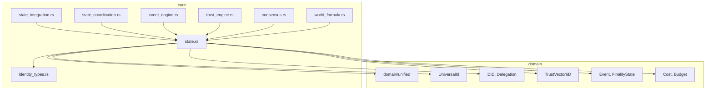

# Erynoa Backend Source-Architektur

> **Basis-Pfad:** `backend/src/`
> **Letzte Analyse:** 2026-02-04

---

## 1. Übersicht der Layer-Architektur

```
┌─────────────────────────────────────────────────────────────────────────────┐
│     API & Server Layer                                                       │
│   (api/, server.rs, telemetry.rs)                                           │
├─────────────────────────────────────────────────────────────────────────────┤
│     Peer Layer (Κ22-Κ24)                                                    │
│   (peer/) - IntentParser, SagaComposer, GatewayGuard                        │
├─────────────────────────────────────────────────────────────────────────────┤
│     Core Logic Layer (Κ2-Κ18)                                               │
│   (core/) - State, EventEngine, TrustEngine, ConsensusEngine                │
├─────────────────────────────────────────────────────────────────────────────┤
│     ECLVM Layer                                                              │
│   (eclvm/) - Erynoa Configuration Language Virtual Machine                  │
├─────────────────────────────────────────────────────────────────────────────┤
│     Execution Layer (IPS Monade ℳ)                                          │
│   (execution/) - ExecutionContext, Gas, Mana                                │
├─────────────────────────────────────────────────────────────────────────────┤
│     Storage/Realm Layer                                                      │
│   (local/) - EventStore, IdentityStore, KVStore                             │
├─────────────────────────────────────────────────────────────────────────────┤
│     Protection Layer (Κ19-Κ21, Κ26-Κ28)                                     │
│   (protection/) - AntiCalcification, DiversityMonitor                       │
├─────────────────────────────────────────────────────────────────────────────┤
│     Domain Layer (Kern-Typen)                                                │
│   (domain/) - UniversalId, TrustVector, DID, Event, Realm, Saga             │
└─────────────────────────────────────────────────────────────────────────────┘
```

---

## 2. Verzeichnisstruktur

```
backend/src/
├── api/                    # REST/gRPC API Layer (15 Dateien)
│   ├── mod.rs
│   ├── routes/            # Axum Route-Definitionen
│   ├── handlers/          # Request-Handler
│   ├── middleware/        # Auth, Logging, Tracing
│   └── proto/             # Connect-RPC/gRPC-Web Definitionen
│
├── bin/                    # Binaries (3 Dateien)
│   ├── main.rs            # Haupt-Server
│   ├── cli.rs             # CLI-Tools
│   └── debugger.rs        # egui Debugger
│
├── config/                 # Konfiguration (3 Dateien)
│   ├── mod.rs
│   ├── settings.rs        # Environment/File Config
│   └── version.rs         # Versionskonstanten
│
├── core/                   # Kern-Logik (12 Dateien, ~1.2 MB)
│   ├── mod.rs             # Re-exports
│   ├── state.rs           # 🔴 ZENTRAL: UnifiedState (21.500 Zeilen)
│   ├── state_integration.rs # Observer-Pattern (6.400 Zeilen)
│   ├── state_coordination.rs # Transaktionen & Health (23 KB)
│   ├── identity_types.rs  # Κ6-Κ8 Identity Traits (32 KB)
│   ├── event_engine.rs    # Κ9-Κ12 Event-Verarbeitung (23 KB)
│   ├── trust_engine.rs    # Κ2-Κ5 Trust-Berechnung (24 KB)
│   ├── consensus.rs       # Κ18 Byzantine-Toleranz (24 KB)
│   ├── world_formula.rs   # Κ15 Weltformel (23 KB)
│   ├── surprisal.rs       # Κ15a Information-Theory (11 KB)
│   ├── engine.rs          # ExecutionContext Wrapper (22 KB)
│   └── eclvm_state_host.rs # ECLVM ↔ State Bridge (2 KB)
│
├── debug/                  # egui Debugger (optional)
│   ├── mod.rs
│   └── state.rs           # DebugState Wrapper
│
├── domain/                 # Domain-Typen (16 Dateien)
│   ├── mod.rs             # Root-Exports
│   └── unified/           # Zukunftssichere Typen (15 Dateien)
│       ├── mod.rs         # InvariantChecker, Re-exports
│       ├── primitives.rs  # UniversalId, TemporalCoord
│       ├── cost.rs        # Cost-Algebra (Gas, Mana, Trust-Risk)
│       ├── trust.rs       # TrustVector6D, TrustRecord
│       ├── identity.rs    # DID, DIDDocument, Delegation
│       ├── event.rs       # Event, FinalityState
│       ├── realm.rs       # Realm, RealmRules, MemberRole
│       ├── saga.rs        # Saga, Intent, SagaAction
│       ├── action.rs      # BlueprintAction, RealmAction, etc.
│       ├── component.rs   # StateComponent, StateRelation
│       ├── system.rs      # SystemMode, EventPriority, AnomalySeverity
│       ├── formula.rs     # WorldFormulaContribution
│       ├── message.rs     # P2P-Nachrichten
│       ├── config.rs      # WorldFormulaConfig
│       └── schema.rs      # Schema-Migrationen
│
├── eclvm/                  # ECL Virtual Machine (19 Dateien)
│   ├── mod.rs
│   ├── vm.rs              # VM-Implementierung
│   ├── bytecode.rs        # Bytecode-Format
│   ├── compiler.rs        # ECL → Bytecode
│   ├── interpreter.rs     # Bytecode-Ausführung
│   ├── host.rs            # Host-Functions (State-Zugriff)
│   ├── policy/            # Policy-Evaluierung
│   └── blueprint/         # Blueprint-Management
│
├── execution/              # Execution Layer (5 Dateien)
│   ├── mod.rs
│   ├── context.rs         # ExecutionContext
│   ├── gas.rs             # Gas-Metering
│   ├── mana.rs            # Mana-Management
│   └── budget.rs          # Budget-Verwaltung
│
├── local/                  # Lokaler Storage (10 Dateien)
│   ├── mod.rs
│   ├── fjall/             # Fjall LSM-Tree Backend
│   ├── event_store.rs     # Event-Persistenz
│   ├── identity_store.rs  # DID-Persistenz
│   ├── kv_store.rs        # Key-Value Store
│   └── archive.rs         # Event-Archivierung
│
├── peer/                   # Peer Layer (42 Dateien)
│   ├── mod.rs
│   ├── swarm/             # libp2p Integration
│   ├── gossip/            # Gossipsub
│   ├── kademlia/          # DHT
│   ├── relay/             # NAT-Traversal
│   ├── privacy/           # Onion-Routing
│   ├── trust_gate/        # Trust-basierte Verbindungen
│   ├── intent_parser/     # Intent → Saga
│   ├── saga_composer/     # Saga-Orchestrierung
│   └── gateway/           # Realm-Crossings
│
├── protection/             # Schutz-Layer (6 Dateien)
│   ├── mod.rs
│   ├── anomaly.rs         # Anomalie-Detection
│   ├── diversity.rs       # Anti-Monokultur
│   ├── anti_calcification.rs # Power-Konzentration
│   ├── calibration.rs     # Parameter-Kalibrierung
│   └── circuit_breaker.rs # System-Degradation
│
├── error.rs               # Fehler-Typen (13 KB)
├── lib.rs                 # Crate-Root
├── main.rs                # Entrypoint
├── server.rs              # Axum-Server (17 KB)
└── telemetry.rs           # OpenTelemetry (1 KB)
```

---

## 3. Modul-Abhängigkeiten

### 3.1 Core-Abhängigkeiten (state.rs)



### 3.2 Import-Analyse state.rs

```rust
// Externe Crates
use serde::{Deserialize, Serialize};
use std::collections::{HashMap, HashSet};
use std::sync::atomic::{AtomicBool, AtomicU64, AtomicU8, AtomicUsize, Ordering};
use std::sync::{Arc, RwLock};
use std::time::{Duration, Instant};
use tokio::sync::{broadcast, mpsc};
use dashmap::DashMap;
use lru::LruCache;
use rustc_hash::FxHasher;
use tokio::sync::RwLock as TokioRwLock;

// Domain Primitives
use crate::domain::unified::primitives::UniversalId;
pub use crate::domain::MemberRole;

// Re-exports aus domain/unified
pub use crate::domain::unified::action::{
    BlueprintAction, MembershipAction, NetworkMetric, RealmAction,
};
pub use crate::domain::unified::component::{ComponentLayer, StateComponent, StateRelation};
pub use crate::domain::unified::system::{AnomalySeverity, EventPriority, SystemMode};

// Identity Types
use crate::core::identity_types::{IdentityError, IdentityResolver};
```

---

## 4. Daten-Typen-Hierarchie

### 4.1 Domain Layer (domain/unified/)

| Datei | Haupttypen | Größe |
|-------|------------|-------|
| `primitives.rs` | `UniversalId`, `TemporalCoord` | ~5 KB |
| `cost.rs` | `Cost`, `Budget`, `CostTable` | ~8 KB |
| `trust.rs` | `TrustVector6D`, `TrustRecord`, `TrustDimension` | ~15 KB |
| `identity.rs` | `DID`, `DIDDocument`, `Delegation`, `Capability` | ~20 KB |
| `event.rs` | `Event`, `EventPayload`, `FinalityState`, `FinalityLevel` | ~25 KB |
| `realm.rs` | `Realm`, `RealmRules`, `MemberRole`, `Partition` | ~20 KB |
| `saga.rs` | `Saga`, `Intent`, `SagaAction`, `StepStatus` | ~18 KB |
| `action.rs` | `BlueprintAction`, `RealmAction`, `MembershipAction` | ~5 KB |
| `component.rs` | `StateComponent` (50+ Varianten), `StateRelation` | ~10 KB |
| `system.rs` | `SystemMode`, `EventPriority`, `AnomalySeverity` | ~3 KB |
| `formula.rs` | `WorldFormulaContribution`, `Activity`, `HumanFactor` | ~8 KB |
| `message.rs` | `P2PMessage`, `SyncRequest`, `AttestationMessage` | ~12 KB |
| `config.rs` | `WorldFormulaConfig`, `TrustConfig` | ~10 KB |
| `schema.rs` | `SchemaRegistry`, `MigrationFn` | ~5 KB |

### 4.2 Core Layer (core/)

| Datei | Haupttypen | Größe |
|-------|------------|-------|
| `state.rs` | `UnifiedState`, `StateEvent`, `EventBus`, `CircuitBreaker`, `MerkleStateTracker` + 100 weitere | **823 KB** |
| `state_integration.rs` | 30+ Observer-Traits, `StateIntegrator`, `CompositeObserver` | 244 KB |
| `state_coordination.rs` | `StateCoordinator`, `StateTransaction`, `HealthReport`, `Invariant` | 23 KB |
| `identity_types.rs` | `IdentityResolver`, `SecureKeyStore`, `PasskeyManager`, `WalletAddress` | 32 KB |
| `event_engine.rs` | `EventEngine`, DAG-Verarbeitung | 23 KB |
| `trust_engine.rs` | `TrustEngine`, Κ2-Κ5 Berechnung | 24 KB |
| `consensus.rs` | `ConsensusEngine`, Byzantine-Toleranz | 24 KB |
| `world_formula.rs` | `WorldFormulaEngine`, 𝔼-Berechnung | 23 KB |
| `surprisal.rs` | `SurprisalCalculator`, Information-Theory Metriken | 11 KB |
| `engine.rs` | `EventProcessor`, `TrustUpdater`, `FormulaComputer`, `FinalityTracker` | 22 KB |

---

## 5. State-Integration Observer-Architektur

Die `state_integration.rs` implementiert das **Observer-Pattern** zur Entkopplung der Engines vom State:

```
┌─────────────────────────────────────────────────────────────────────────────┐
│                           ENGINE LAYER                                       │
│                                                                              │
│  ┌──────────────┐  ┌──────────────┐  ┌──────────────┐  ┌──────────────┐    │
│  │ TrustEngine  │  │ EventEngine  │  │ConsensusEngine  │WorldFormulaEngine│ │
│  └──────┬───────┘  └──────┬───────┘  └──────┬───────┘  └──────┬───────┘    │
│         │                 │                 │                 │              │
│         │                 │                 │                 │              │
│  ┌──────▼───────┐  ┌──────▼───────┐  ┌──────▼───────┐  ┌──────▼───────┐    │
│  │TrustObserver │  │EventObserver │  │ConsensusObserver│FormulaObserver│   │
│  └──────────────┘  └──────────────┘  └──────────────┘  └──────────────┘    │
│                                                                              │
│                           implements                                         │
│                              │                                               │
│                              ▼                                               │
│                    ┌─────────────────┐                                       │
│                    │ StateIntegrator │  (facade)                             │
│                    └────────┬────────┘                                       │
│                             │                                                │
│                             ▼                                                │
│                    ┌─────────────────┐                                       │
│                    │  UnifiedState   │                                       │
│                    └─────────────────┘                                       │
│                                                                              │
└─────────────────────────────────────────────────────────────────────────────┘
```

### 5.1 Observer-Traits (30+)

| Observer | Axiom | Beschreibung |
|----------|-------|--------------|
| `TrustObserver` | Κ2-Κ5 | Trust-Updates, Violations |
| `EventObserver` | Κ9-Κ12 | Event-Registrierung, Finalisierung |
| `FormulaObserver` | Κ15 | Weltformel-Neuberechnung |
| `ConsensusObserver` | Κ18 | Runden-Metriken, Byzantine-Detection |
| `ExecutionObserver` | - | Gas/Mana-Verbrauch |
| `ProtectionObserver` | Κ19-Κ21 | Anomalien, Diversity-Warnungen |
| `StorageObserver` | - | I/O-Metriken |
| `GatewayObserver` | Κ23 | Crossing-Events |
| `SagaObserver` | Κ22, Κ24 | Saga-Fortschritt |
| `IntentObserver` | - | Intent-Parsing |
| `RealmObserver` | Κ22-Κ24 | Realm-Lifecycle, Membership |
| `ECLVMObserver` | - | Policy-Evaluationen, Blueprint-Aktionen |
| `GossipObserver` | - | Message-Routing |
| `KademliaObserver` | - | DHT-Queries |
| `SwarmObserver` | - | Peer-Connections |
| `RelayObserver` | - | Relay-Nutzung |
| `PrivacyObserver` | - | Onion-Circuit-Metriken |
| `UIObserver` | - | UI-Events |
| `DataLogicObserver` | - | Aggregation-Events |
| `APIObserver` | - | Request-Metriken |
| `ControllerObserver` | - | Permission-Changes |
| `GovernanceObserver` | - | Voting-Events |
| `BlueprintComposerObserver` | - | Blueprint-Instanziierung |

---

## 6. Axiom-Mapping auf Module

| Axiom | Beschreibung | Module |
|-------|--------------|--------|
| **Κ1** | Realm-Hierarchie | `domain/unified/realm.rs`, `peer/gateway/` |
| **Κ2-Κ5** | Trust-System | `core/trust_engine.rs`, `domain/unified/trust.rs` |
| **Κ6-Κ8** | Identity/DID | `core/identity_types.rs`, `domain/unified/identity.rs` |
| **Κ9-Κ12** | Kausale Events | `core/event_engine.rs`, `domain/unified/event.rs` |
| **Κ13-Κ14** | Gateway-Regeln | `peer/gateway/` |
| **Κ15a-d** | Weltformel | `core/world_formula.rs`, `core/surprisal.rs` |
| **Κ16-Κ17** | Human-Factor | `domain/unified/formula.rs` |
| **Κ18** | Konsensus | `core/consensus.rs` |
| **Κ19** | Diversity | `protection/diversity.rs`, `core/state.rs` (Gini) |
| **Κ20** | Quadratic Voting | `peer/governance/` |
| **Κ21** | Anti-Calcification | `protection/anti_calcification.rs` |
| **Κ22-Κ24** | Realm-Isolation | `peer/realm/`, `core/state.rs` (RealmQuota) |
| **Κ25** | Privacy | `peer/privacy/` |
| **Κ26-Κ28** | Protection | `protection/` |

---

## 7. Kritische Pfade

### 7.1 Event-Verarbeitung

```
1. P2P-Message empfangen (peer/swarm/)
      │
2. NetworkEvent erstellt
      │
3. EventBus.try_send_ingress()
      │
4. Core Processor (async Task)
      │
5. UnifiedState.log_and_apply(StateEvent)
      │
      ├── 5a. StateEventLog.log() [Event-Sourcing]
      │
      ├── 5b. apply_state_event() [State-Mutation]
      │
      ├── 5c. StateBroadcaster.broadcast() [CQRS]
      │
      └── 5d. MerkleStateTracker.update_component()
      │
6. Optional: Checkpoint bei threshold
```

### 7.2 Trust-Update

```
1. TrustEngine.update(entity, delta)
      │
2. TrustObserver.on_trust_update() [Observer]
      │
3. UnifiedState.core.trust.update()
      │
4. StateEvent::TrustUpdate erstellt
      │
5. log_and_apply() → Persistence
      │
6. StateDelta broadcast → Subscriber
```

### 7.3 Realm-Crossing

```
1. Intent: Cross from Realm A → Realm B
      │
2. IntentParser → SagaComposer
      │
3. GatewayGuard.evaluate()
      │
      ├── 3a. ECLPolicy.validate() [ECLVM]
      │
      ├── 3b. trust_check(entity, realm_b)
      │
      └── 3c. quota_check(realm_b, ResourceType)
      │
4. GatewayObserver.on_crossing_evaluated()
      │
5. StateEvent::CrossingEvaluated
      │
6. Falls erlaubt: Saga-Step fortsetzen
```

---

## 8. Performance-Hotspots

| Bereich | Datei | Optimierung |
|---------|-------|-------------|
| Trust-Lookup | `state.rs` | DashMap (lock-free concurrent) |
| Event-Buffer | `state.rs` | Ring-Buffer (O(1) amortisiert) |
| Merkle-Updates | `state.rs` | Inkrementelle Hash-Updates |
| Peer-Connections | `peer/swarm/` | Connection-Pool |
| Policy-Evaluierung | `eclvm/` | Bytecode-Caching |
| Snapshot-Erstellung | `state.rs` | Atomic loads, keine Deep-Clones |

---

## 9. Test-Strategie

```
backend/tests/
├── api/                    # Integration-Tests für REST-API
├── core/                   # Unit-Tests für Core-Layer
│   ├── state_tests.rs
│   ├── trust_engine_tests.rs
│   └── event_engine_tests.rs
├── eclvm/                  # ECLVM-Tests
├── peer/                   # P2P-Integration-Tests
└── fixtures/               # Test-Daten
```

**Test-Patterns:**
- Jede State-Struktur hat `::new()` für Tests
- Observer-Traits ermöglichen Mock-Injection
- `NoOpEmitter` für Tests ohne Event-Persistenz

---

## 10. Erweiterungsempfehlungen

### 10.1 Kurzfristig

1. **Sharding** für `UnifiedState` (v0.5.0)
   - Trust-Cache pro Shard
   - Event-Log-Partitionierung

2. **Tiefere Merkle-Trees**
   - Sub-Komponenten-Ebene (z.B. einzelne Realms)
   - Effizientere Light-Client-Proofs

3. **Optimistic Locking**
   - Für Engine-Layer-States
   - Reduziert RwLock-Contention

### 10.2 Langfristig

1. **Cross-Node Event-Sync**
   - Merkle-Deltas über Gossip
   - Checkpoint-Coordination

2. **State-Kompression**
   - LZ4 für Archive
   - Snapshot-Deduplizierung

3. **WASM-Plugins**
   - Custom StateComponents
   - Domain-spezifische Policies

---

## 11. Glossar

| Begriff | Bedeutung |
|---------|-----------|
| **𝔼** | Weltformel-Wert (Κ15) |
| **UniversalId** | 20-Byte ID (Tag + Shard + ContentHash) |
| **TemporalCoord** | (Depth, Lamport, NodeId) |
| **TrustVector6D** | 6-dimensionaler Trust-Vektor |
| **DID** | Decentralized Identifier |
| **ECLVM** | Erynoa Configuration Language VM |
| **Saga** | Cross-Realm Transaktion |
| **Intent** | Benutzer-Absicht für SagaComposer |
| **Realm** | Isolierte Domäne mit eigenen Regeln |
| **Crossing** | Realm-übergreifende Operation |
| **StateComponent** | Enum mit 50+ State-Typen |
| **CircuitBreaker** | Automatische Degradation |

---

## 12. Referenzen

- **Haupt-Dokumentation:** `STATE-RS-ARCHITECTURE-DEEP-DIVE.md`
- **Refactoring-Plan:** `STATE-RS-REFACTORING-PLAN.md`
- **Gap-Analyse:** `ECL-STATE-RS-GAP-ANALYSIS.md`
- **API-Dokumentation:** `backend/documentation/api/`
