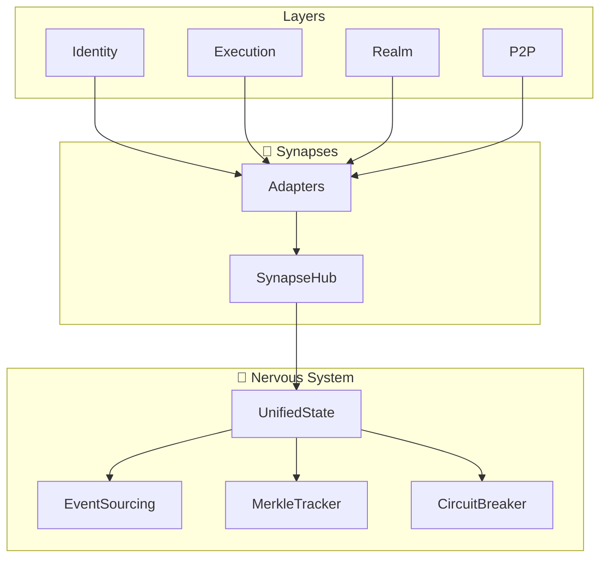

# 🔄 ERYNOA BACKEND MEGA-REFACTORING PLAN

> **Codename:** Project Synapsis
> **Version:** 1.0.0
> **Erstellt:** 2026-02-04
> **Ziel:** Homogene, hocheffiziente Architektur mit `state.rs` als zentralem Nervensystem

---

## 🎯 Executive Vision

```
                    ╔══════════════════════════════════════════════════════════╗
                    ║                    ERYNOA SYNAPSIS                       ║
                    ║                                                          ║
                    ║   "Ein lebendiges System, in dem jede Komponente         ║
                    ║    nahtlos mit dem zentralen Nervensystem verbunden      ║
                    ║    ist – effizient, elegant, evolutionsfähig."           ║
                    ╚══════════════════════════════════════════════════════════╝
```

---

## 📊 Ist-Zustand Analyse

### Probleme

| Problem | Auswirkung | Schweregrad |
|---------|------------|-------------|
| **state.rs hat 21.495 Zeilen** | Unübersichtlich, schwer wartbar | 🔴 Kritisch |
| **Doppelte Implementierungen** | Inkonsistenz, Code-Bloat | 🟡 Hoch |
| **Lose Kopplung** | Module kommunizieren inkonsistent | 🟡 Hoch |
| **Veraltete Patterns** | Legacy-Code vermischt mit neuem Code | 🟡 Hoch |
| **Fehlende einheitliche Fehlerbehandlung** | Verschiedene Error-Typen | 🟠 Mittel |
| **Inkonsistente Naming-Conventions** | Verwirrung, Onboarding-Hürden | 🟠 Mittel |
| **Test-Coverage-Lücken** | Regressionsrisiko | 🟠 Mittel |

### Metriken (Vor Refactoring)

```
├── core/state.rs           → 21.495 Zeilen, 823 KB
├── core/state_integration.rs → 6.427 Zeilen, 244 KB
├── local/realm_storage.rs   → ~106 KB (Kandidat für Extraktion)
├── local/blueprint_marketplace.rs → 71 KB (Kandidat für Extraktion)
├── peer/p2p/ (38 Dateien)  → Bedarf Konsolidierung
├── eclvm/ (14 Dateien)     → Gut strukturiert, minimale Änderungen
```

---

## 🏗️ Ziel-Architektur: Das Nervensystem

```
                              ┌─────────────────────────────────────┐
                              │         🧠 UNIFIED STATE            │
                              │     (Zentrales Nervensystem)        │
                              │                                     │
                              │  • Event-Sourcing Core              │
                              │  • Merkle-basierte Verifizierung    │
                              │  • Circuit Breaker                  │
                              │  • Health Monitoring                │
                              └───────────────┬─────────────────────┘
                                              │
              ┌───────────────────────────────┼───────────────────────────────┐
              │                               │                               │
              ▼                               ▼                               ▼
    ┌─────────────────┐           ┌─────────────────┐           ┌─────────────────┐
    │  🔌 SYNAPSES    │           │  📡 SIGNALS     │           │  🛡️ REFLEXES    │
    │  (Observer Hub) │           │  (Event Bus)    │           │  (Protection)   │
    │                 │           │                 │           │                 │
    │ • StateObserver │           │ • NetworkEvent  │           │ • CircuitBreaker│
    │ • EngineAdapter │           │ • StateEvent    │           │ • AnomalyGuard  │
    │ • P2PBridge     │           │ • StateDelta    │           │ • QuotaEnforcer │
    └────────┬────────┘           └────────┬────────┘           └────────┬────────┘
             │                             │                             │
             └─────────────────────────────┴─────────────────────────────┘
                                           │
        ┌──────────────────────────────────┼──────────────────────────────────┐
        │                                  │                                  │
        ▼                                  ▼                                  ▼
┌───────────────┐               ┌───────────────┐               ┌───────────────┐
│ 🆔 IDENTITY   │               │ ⚙️ EXECUTION  │               │ 🌐 PEER       │
│   Layer       │               │    Layer      │               │    Layer      │
│               │               │               │               │               │
│ • DID/Sub-DID │               │ • Gas/Mana    │               │ • Realm       │
│ • Credentials │               │ • ECLVM       │               │ • Gateway     │
│ • Delegation  │               │ • Policies    │               │ • P2P Network │
└───────────────┘               └───────────────┘               └───────────────┘
```

---

## 🗺️ Refactoring-Phasen Übersicht

```
╔═══════════════════════════════════════════════════════════════════════════════╗
║  PHASE 1: FOUNDATION    │  PHASE 2: DECOMPOSITION  │  PHASE 3: SYNAPSE HUB   ║
║  (Woche 1-2)            │  (Woche 3-5)             │  (Woche 6-7)            ║
║                         │                          │                         ║
║  • Neue Verzeichnis-    │  • state.rs aufteilen    │  • Unified Observer     ║
║    struktur             │  • Module extrahieren    │  • Adapter-Pattern      ║
║  • Einheitliche Traits  │  • Legacy entfernen      │  • Bridge-Interfaces    ║
║  • Error-Vereinheitl.   │  • Tests migrieren       │                         ║
╠═══════════════════════════════════════════════════════════════════════════════╣
║  PHASE 4: INTEGRATION   │  PHASE 5: OPTIMIZATION   │  PHASE 6: POLISH        ║
║  (Woche 8-9)            │  (Woche 10-11)           │  (Woche 12)             ║
║                         │                          │                         ║
║  • Engine-Layer Refact. │  • Performance-Tuning    │  • Documentation        ║
║  • P2P Konsolidierung   │  • Memory-Footprint      │  • API-Stabilisierung   ║
║  • Storage-Layer        │  • Benchmarks            │  • Release-Vorber.      ║
╚═══════════════════════════════════════════════════════════════════════════════╝
```

---

# 📋 PHASE 1: FOUNDATION (Woche 1-2)

## 1.1 Neue Verzeichnisstruktur

**Ziel:** Klare, hierarchische Organisation nach dem Nervensystem-Pattern

```
backend/src/
├── lib.rs                      # Crate-Root (minimal, nur Re-exports)
├── main.rs                     # Entrypoint
│
├── 🧠 nervous_system/          # [NEU] Zentrales State-Management
│   ├── mod.rs                  # Öffentliche API
│   ├── unified_state.rs        # UnifiedState (aus state.rs extrahiert)
│   ├── event_sourcing/         # Event-Sourcing Subsystem
│   │   ├── mod.rs
│   │   ├── state_event.rs      # StateEvent enum
│   │   ├── wrapped_event.rs    # WrappedStateEvent + DAG
│   │   ├── event_log.rs        # StateEventLog
│   │   └── replay.rs           # Recovery + Replay
│   ├── merkle/                 # Merkle-Verifizierung
│   │   ├── mod.rs
│   │   ├── tracker.rs          # MerkleStateTracker
│   │   ├── delta.rs            # MerkleDelta
│   │   └── proofs.rs           # State-Proofs für Light-Clients
│   ├── components/             # StateComponent-States
│   │   ├── mod.rs
│   │   ├── core.rs             # TrustState, EventState, FormulaState, ConsensusState
│   │   ├── execution.rs        # ExecutionState, GasState, ManaState
│   │   ├── protection.rs       # ProtectionState, AnomalyState, DiversityState
│   │   ├── peer.rs             # PeerState, RealmState, GatewayState
│   │   ├── p2p.rs              # P2PState, SwarmState, GossipState
│   │   ├── identity.rs         # IdentityState
│   │   └── eclvm.rs            # ECLVMState
│   ├── coordination/           # State-Koordination
│   │   ├── mod.rs
│   │   ├── coordinator.rs      # StateCoordinator
│   │   ├── transaction.rs      # StateTransaction
│   │   └── health.rs           # HealthReport, Invariants
│   ├── graph/                  # StateGraph
│   │   ├── mod.rs
│   │   ├── components.rs       # StateComponent enum
│   │   ├── relations.rs        # StateRelation enum
│   │   └── analysis.rs         # Graph-Analyse-Methoden
│   └── infrastructure/         # Infrastruktur
│       ├── mod.rs
│       ├── event_bus.rs        # EventBus (Ingress/Egress)
│       ├── broadcaster.rs      # StateBroadcaster (CQRS)
│       ├── circuit_breaker.rs  # CircuitBreaker
│       ├── multi_gas.rs        # MultiGas
│       └── storage_handle.rs   # StorageHandle
│
├── 🔌 synapses/                # [NEU] Observer-Hub & Adapter
│   ├── mod.rs
│   ├── traits.rs               # Alle Observer-Traits (konsolidiert)
│   ├── integrator.rs           # StateIntegrator (Facade)
│   ├── composite.rs            # CompositeObserver
│   └── adapters/               # Engine-Adapter
│       ├── mod.rs
│       ├── trust_adapter.rs
│       ├── event_adapter.rs
│       ├── eclvm_adapter.rs
│       ├── p2p_adapter.rs
│       └── realm_adapter.rs
│
├── 🆔 identity/                # [REFACTORED] Identity-Layer
│   ├── mod.rs
│   ├── types.rs                # DID, DIDDocument, Delegation (aus domain/)
│   ├── state.rs                # IdentityState
│   ├── resolver.rs             # IdentityResolver
│   ├── key_store.rs            # SecureKeyStore trait + impls
│   ├── passkey.rs              # PasskeyManager
│   └── wallet.rs               # WalletAddress + Derivation
│
├── ⚙️ execution/               # [ENHANCED] Execution-Layer
│   ├── mod.rs
│   ├── context.rs              # ExecutionContext
│   ├── gas/                    # Gas-Subsystem
│   │   ├── mod.rs
│   │   ├── metering.rs
│   │   ├── multi_layer.rs      # L1-L4 Gas
│   │   └── pricing.rs          # Congestion Pricing
│   ├── mana/                   # Mana-Subsystem
│   │   ├── mod.rs
│   │   ├── regeneration.rs
│   │   └── budget.rs
│   └── tracked.rs              # TrackedValue (IPS)
│
├── 🌐 realm/                   # [REFACTORED] Realm-Layer (aus peer/)
│   ├── mod.rs
│   ├── state.rs                # RealmSpecificState
│   ├── sharding/               # Lazy Sharded Realm
│   │   ├── mod.rs
│   │   ├── config.rs
│   │   ├── lazy_state.rs
│   │   └── eviction.rs
│   ├── quota/                  # Realm-Quotas
│   │   ├── mod.rs
│   │   ├── enforcer.rs
│   │   └── self_healing.rs     # Auto-Quarantine
│   ├── gateway/                # Realm-Crossings
│   │   ├── mod.rs
│   │   ├── guard.rs
│   │   └── policy.rs
│   └── saga/                   # Saga-Composer
│       ├── mod.rs
│       ├── composer.rs
│       ├── orchestrator.rs
│       └── compensation.rs
│
├── 🛡️ protection/              # [ENHANCED] Protection-Layer
│   ├── mod.rs
│   ├── anomaly/
│   │   ├── mod.rs
│   │   ├── detector.rs
│   │   ├── ml_pipeline.rs      # [FUTURE] ML-basierte Anomalie-Detection
│   │   └── thresholds.rs
│   ├── diversity/
│   │   ├── mod.rs
│   │   ├── gini.rs
│   │   └── monitor.rs
│   ├── anti_calcification/
│   │   ├── mod.rs
│   │   ├── decay.rs
│   │   └── rotation.rs
│   └── calibration/
│       ├── mod.rs
│       └── adaptive.rs
│
├── 🔗 p2p/                     # [CONSOLIDATED] P2P-Layer
│   ├── mod.rs
│   ├── swarm/                  # libp2p Swarm
│   │   ├── mod.rs
│   │   ├── manager.rs
│   │   └── config.rs
│   ├── gossip/                 # GossipSub
│   │   ├── mod.rs
│   │   ├── handler.rs
│   │   └── topics.rs
│   ├── dht/                    # Kademlia
│   │   ├── mod.rs
│   │   └── resolver.rs
│   ├── relay/                  # NAT-Traversal
│   │   ├── mod.rs
│   │   └── circuit.rs
│   ├── privacy/                # Onion-Routing
│   │   ├── mod.rs
│   │   ├── circuit.rs
│   │   └── cover_traffic.rs
│   └── trust_gate/             # Trust-basierte Verbindungen
│       ├── mod.rs
│       └── gate.rs
│
├── 🎛️ eclvm/                   # [MINIMAL CHANGES] ECLVM
│   └── ... (wie bisher, gut strukturiert)
│
├── 📦 storage/                 # [REFACTORED] Storage-Layer (aus local/)
│   ├── mod.rs
│   ├── kv/                     # Key-Value Store
│   │   ├── mod.rs
│   │   ├── fjall.rs
│   │   └── traits.rs
│   ├── event_store/            # Event-Sourcing Backend
│   │   ├── mod.rs
│   │   └── adapter.rs
│   ├── archive/                # Langzeit-Archivierung
│   │   ├── mod.rs
│   │   └── compression.rs
│   ├── identity_store/         # DID-Persistenz
│   │   ├── mod.rs
│   │   └── migration.rs
│   └── blueprint/              # Blueprint-Storage
│       ├── mod.rs
│       └── marketplace.rs
│
├── 🌐 api/                     # [ENHANCED] API-Layer
│   ├── mod.rs
│   ├── routes/
│   ├── handlers/
│   ├── middleware/
│   └── grpc/                   # [NEU] gRPC neben REST
│
├── 🔧 core/                    # [LEGACY → MINIMAL] Nur noch Re-Exports
│   ├── mod.rs                  # Re-exports für Rückwärtskompatibilität
│   └── compat.rs               # Deprecated-Wrapper
│
├── 📊 domain/                  # [ENHANCED] Domain-Typen
│   ├── mod.rs
│   └── unified/
│       ├── mod.rs
│       ├── primitives.rs       # UniversalId, TemporalCoord
│       ├── cost.rs             # Cost-Algebra
│       ├── trust.rs            # TrustVector6D
│       ├── event.rs            # Event, FinalityState
│       ├── realm.rs            # Realm, RealmRules
│       ├── saga.rs             # Saga, Intent
│       └── error.rs            # [NEU] Unified Error Types
│
├── config/                     # Konfiguration
├── error.rs                    # [DEPRECATED → domain/unified/error.rs]
├── server.rs
└── telemetry.rs
```

## 1.2 Einheitliche Trait-Definitionen

**Datei:** `nervous_system/traits.rs`

```rust
// ═══════════════════════════════════════════════════════════════════════════════
// UNIFIED TRAIT LIBRARY
// ═══════════════════════════════════════════════════════════════════════════════

/// Trait für alle State-Komponenten
pub trait StateLayer: Send + Sync {
    type Snapshot: Clone + Serialize + for<'de> Deserialize<'de>;

    fn snapshot(&self) -> Self::Snapshot;
    fn health_score(&self) -> f64;
    fn apply_event(&self, event: &WrappedStateEvent);
}

/// Trait für Komponenten die Reset unterstützen
pub trait Resettable {
    fn reset(&self);
}

/// Trait für metrische Komponenten
pub trait Metered {
    fn record(&self, metric: &str, value: f64);
    fn counter(&self, metric: &str) -> u64;
}

/// Universeller Observer-Trait
pub trait StateObserver: Send + Sync {
    fn on_event(&self, event: &WrappedStateEvent);
    fn component(&self) -> StateComponent;
    fn priority(&self) -> ObserverPriority;
}

/// Observer-Priorität
pub enum ObserverPriority {
    Critical = 0,  // Anomaly, CircuitBreaker
    High = 1,      // Trust, Consensus
    Normal = 2,    // Default
    Low = 3,       // Metrics, Logging
}
```

## 1.3 Unified Error Types

**Datei:** `domain/unified/error.rs`

```rust
// ═══════════════════════════════════════════════════════════════════════════════
// UNIFIED ERROR HIERARCHY
// ═══════════════════════════════════════════════════════════════════════════════

use thiserror::Error;

/// Root-Error für alle Erynoa-Operationen
#[derive(Debug, Error)]
pub enum ErynoaError {
    #[error("Identity error: {0}")]
    Identity(#[from] IdentityError),

    #[error("Execution error: {0}")]
    Execution(#[from] ExecutionError),

    #[error("Realm error: {0}")]
    Realm(#[from] RealmError),

    #[error("Storage error: {0}")]
    Storage(#[from] StorageError),

    #[error("P2P error: {0}")]
    P2P(#[from] P2PError),

    #[error("ECLVM error: {0}")]
    ECLVM(#[from] ECLVMError),

    #[error("State error: {0}")]
    State(#[from] StateError),

    #[error("Internal error: {0}")]
    Internal(String),
}

/// Identity-spezifische Fehler
#[derive(Debug, Error)]
pub enum IdentityError {
    #[error("Not bootstrapped")]
    NotBootstrapped,
    #[error("Key store not initialized")]
    KeyStoreNotInitialized,
    #[error("Signature verification failed")]
    SignatureVerificationFailed,
    #[error("Delegation chain invalid")]
    DelegationChainInvalid,
    #[error("Unknown identity: {0}")]
    UnknownIdentity(String),
}

/// Execution-spezifische Fehler
#[derive(Debug, Error)]
pub enum ExecutionError {
    #[error("Gas exhausted: required {required}, available {available}")]
    GasExhausted { required: u64, available: u64 },
    #[error("Mana exhausted: required {required}, available {available}")]
    ManaExhausted { required: u64, available: u64 },
    #[error("Budget exceeded")]
    BudgetExceeded,
    #[error("Execution timeout after {0}ms")]
    Timeout(u64),
}

/// Realm-spezifische Fehler
#[derive(Debug, Error)]
pub enum RealmError {
    #[error("Realm not found: {0}")]
    NotFound(String),
    #[error("Realm quarantined: {0}")]
    Quarantined(String),
    #[error("Quota exceeded for {resource}: requested {requested}, limit {limit}")]
    QuotaExceeded { resource: String, requested: u64, limit: u64 },
    #[error("Crossing denied: {reason}")]
    CrossingDenied { reason: String },
}

/// Result-Alias
pub type ErynoaResult<T> = Result<T, ErynoaError>;
```

---

# 📋 PHASE 2: DECOMPOSITION (Woche 3-5)

## 2.1 state.rs Aufteilen

Die 21.495 Zeilen werden in **modular aufgebaute Dateien** extrahiert:

### Extraktion-Mapping

| Zeilen (ca.) | Ziel-Datei | Inhalt |
|--------------|------------|--------|
| 1-800 | `infrastructure/event_bus.rs` | NetworkEvent, EventBus, StateBroadcaster |
| 800-1900 | `event_sourcing/state_event.rs` | StateEvent enum (42 Varianten) |
| 1900-2200 | `event_sourcing/wrapped_event.rs` | WrappedStateEvent, Kausalität |
| 2200-2500 | `merkle/` | MerkleHash, MerkleDelta, MerkleStateTracker |
| 2500-2740 | `infrastructure/multi_gas.rs` | MultiGas, GasLayer |
| 2740-2980 | `realm/quota/` | RealmQuota, ResourceType |
| 2980-4080 | `identity/state.rs` | IdentityState, IdentitySnapshot |
| 4080-4450 | `graph/` | StateGraph, StateComponent, StateRelation |
| 4450-6000 | `components/core.rs` | TrustState, EventState, FormulaState |
| 6000-7500 | `components/protection.rs` | ProtectionState, AnomalyState |
| 7500-9000 | `components/peer.rs` | PeerState, RealmState |
| 9000-10000 | `components/p2p.rs` | P2PState, SwarmState |
| 10000-11800 | `components/eclvm.rs` | ECLVMState, GovernanceState |
| 11800-21495 | `unified_state.rs` + Tests | UnifiedState, create_unified_state() |

### Schritt-für-Schritt Vorgehen

```bash
# 1. Neue Verzeichnisse erstellen
mkdir -p backend/src/nervous_system/{event_sourcing,merkle,components,coordination,graph,infrastructure}
mkdir -p backend/src/synapses/adapters
mkdir -p backend/src/realm/{sharding,quota,gateway,saga}

# 2. Dateien extrahieren (manuell mit Checks)
# Für jede Extraktion:
# a) Code kopieren
# b) Imports anpassen
# c) Tests migrieren
# d) Compilation prüfen
# e) Tests ausführen

# 3. Re-Exports in mod.rs pflegen
```

## 2.2 Legacy-Code Entfernen

### Identifizierte Legacy-Patterns

| Pattern | Ort | Aktion |
|---------|-----|--------|
| `pub use crate::domain::...` in state.rs | Zeile 14-26 | Nach domain/mod.rs verschieben |
| Doppelte Snapshot-Definitionen | Mehrere | Konsolidieren in `traits.rs` |
| `#[cfg(test)]` Module inline | state.rs | Nach `tests/` verschieben |
| `_legacy` Suffixe | Diverse | Entfernen nach Migration |
| Auskommentierter Code | Diverse | Entfernen |

### Dead-Code-Analyse

```bash
# Führe Dead-Code-Analyse durch
cargo +nightly udeps --all-targets

# Identifiziere ungenutzte Features
cargo clippy --all-features -- -W dead_code
```

## 2.3 state_integration.rs Refactoring

Die 6.427 Zeilen werden zu **synapses/** konsolidiert:

```rust
// synapses/traits.rs - Alle Observer-Traits an einem Ort
pub trait TrustObserver: StateObserver { ... }
pub trait EventObserver: StateObserver { ... }
pub trait ProtectionObserver: StateObserver { ... }
// ... (30+ Traits)

// synapses/integrator.rs - Vereinfachte Facade
pub struct StateIntegrator {
    observers: Vec<Arc<dyn StateObserver>>,
    priority_queue: BinaryHeap<PrioritizedObserver>,
}

impl StateIntegrator {
    pub fn notify(&self, event: &WrappedStateEvent) {
        for observer in self.observers.iter() {
            observer.on_event(event);
        }
    }
}
```

---

# 📋 PHASE 3: SYNAPSE HUB (Woche 6-7)

## 3.1 Unified Observer-Architektur

```rust
// synapses/hub.rs

/// Zentraler Observer-Hub (das "Synapse"-Pattern)
pub struct SynapseHub {
    /// Alle registrierten Observer nach Komponente
    observers: DashMap<StateComponent, Vec<Arc<dyn StateObserver>>>,

    /// Priority-Queue für Event-Dispatch
    dispatch_queue: tokio::sync::mpsc::Sender<DispatchTask>,

    /// Metriken
    dispatch_count: AtomicU64,
    observer_errors: AtomicU64,
}

impl SynapseHub {
    /// Registriere Observer für Komponente
    pub fn register(&self, component: StateComponent, observer: Arc<dyn StateObserver>) {
        self.observers.entry(component).or_default().push(observer);
    }

    /// Dispatch Event an alle relevanten Observer
    pub async fn dispatch(&self, event: WrappedStateEvent) {
        let component = event.component;

        // 1. Direkte Observer
        if let Some(observers) = self.observers.get(&component) {
            for observer in observers.value() {
                observer.on_event(&event);
            }
        }

        // 2. Transitive Observer (via StateGraph)
        let triggered = STATE_GRAPH.triggered_by(component);
        for target in triggered {
            if let Some(observers) = self.observers.get(&target) {
                for observer in observers.value() {
                    observer.on_event(&event);
                }
            }
        }

        self.dispatch_count.fetch_add(1, Ordering::Relaxed);
    }
}
```

## 3.2 Adapter-Pattern für externe Module

```rust
// synapses/adapters/p2p_adapter.rs

/// Adapter: P2P-Layer → UnifiedState
pub struct P2PStateAdapter {
    state: SharedUnifiedState,
    emitter: ChannelEmitter,
}

impl P2PStateAdapter {
    /// Wird von SwarmManager aufgerufen
    pub fn on_peer_connected(&self, peer_id: &str, peer_uid: Option<UniversalId>) {
        // 1. State aktualisieren
        self.state.p2p.swarm.connected_peers.fetch_add(1, Ordering::Relaxed);

        // 2. Event emittieren
        self.emitter.emit(StateEvent::PeerConnectionChange {
            peer_id: peer_id.to_string(),
            peer_universal_id: peer_uid,
            connected: true,
            addr: None,
            connection_level: Some("full".to_string()),
        });
    }
}
```

---

# 📋 PHASE 4: INTEGRATION (Woche 8-9)

## 4.1 Engine-Layer Refactoring

### Aktuelle Engine-Struktur

```
peer/
├── gateway.rs      → 20 KB
├── intent_parser.rs → 11 KB
├── saga_composer.rs → 21 KB
└── p2p/ (38 files) → ~400 KB total
```

### Ziel-Struktur

```
realm/
├── gateway/        # Realm-Crossings
├── saga/           # Saga-Orchestrierung

p2p/
├── swarm/          # Konsolidiert
├── gossip/         # Konsolidiert
├── dht/            # Konsolidiert
└── privacy/        # Konsolidiert
```

## 4.2 P2P Konsolidierung

Die 38 Dateien in `peer/p2p/` werden zu **~15 Dateien** konsolidiert:

| Bisherige Dateien | Neue Struktur |
|-------------------|---------------|
| `swarm/*.rs` (8 Dateien) | `p2p/swarm/manager.rs`, `p2p/swarm/config.rs` |
| `gossipsub/*.rs` (6 Dateien) | `p2p/gossip/handler.rs`, `p2p/gossip/topics.rs` |
| `kademlia/*.rs` (5 Dateien) | `p2p/dht/resolver.rs` |
| `relay/*.rs` (4 Dateien) | `p2p/relay/circuit.rs` |
| `privacy/*.rs` (8 Dateien) | `p2p/privacy/circuit.rs`, `p2p/privacy/cover_traffic.rs` |

## 4.3 Storage-Layer Vereinheitlichung

```rust
// storage/traits.rs

/// Unified Storage-Trait
pub trait Storage: Send + Sync {
    type Error: std::error::Error;

    async fn get(&self, key: &[u8]) -> Result<Option<Vec<u8>>, Self::Error>;
    async fn put(&self, key: &[u8], value: Vec<u8>) -> Result<(), Self::Error>;
    async fn delete(&self, key: &[u8]) -> Result<(), Self::Error>;
    async fn exists(&self, key: &[u8]) -> Result<bool, Self::Error>;
}

/// Typed Storage-Wrapper
pub struct TypedStorage<T: Serialize + DeserializeOwned> {
    inner: Arc<dyn Storage<Error = StorageError>>,
    _phantom: PhantomData<T>,
}
```

---

# 📋 PHASE 5: OPTIMIZATION (Woche 10-11)

## 5.1 Performance-Tuning

### Hot-Path-Optimierungen

| Hot-Path | Aktuelle Komplexität | Ziel |
|----------|---------------------|------|
| Trust-Lookup | O(1) DashMap | Beibehalten |
| Event-Dispatch | O(n) Observer | O(1) via IndexMap |
| Merkle-Update | O(n) Komponenten | O(log n) via Tree |
| Snapshot | O(n) RwLock-Reads | Parallele Reads |

### Lock-Contention-Reduktion

```rust
// Vorher: Globaler RwLock
pub trust_by_id: RwLock<HashMap<UniversalId, TrustEntry>>

// Nachher: Sharded DashMap
pub trust_by_id: DashMap<UniversalId, TrustEntry, FxBuildHasher>
```

## 5.2 Memory-Footprint-Reduktion

### Ziel-Metriken

| Komponente | Aktuell (geschätzt) | Ziel |
|------------|---------------------|------|
| UnifiedState | ~100 MB | ~60 MB |
| Event-Log | ~5 MB | ~3 MB (Compression) |
| Merkle-Tracker | ~1 MB | ~0.5 MB |
| P2P-Caches | ~20 MB | ~10 MB (LRU) |

### Strategien

1. **Event-Kompression:** LZ4 für Event-Payloads > 1 KB
2. **Lazy Loading:** Realms nur bei Bedarf laden
3. **TTL-Caches:** Automatische Eviction alter Daten
4. **String-Interning:** Häufige Strings (DID-Prefixe) internen

## 5.3 Benchmarks

```rust
// benchmarks/state_benchmarks.rs

#[bench]
fn bench_trust_lookup(b: &mut Bencher) {
    let state = create_unified_state();
    let id = UniversalId::random();
    state.core.trust.register_identity(id, 0.5).unwrap();

    b.iter(|| {
        black_box(state.core.trust.get_trust(&id));
    });
}

#[bench]
fn bench_event_dispatch(b: &mut Bencher) {
    let state = create_unified_state();
    let event = StateEvent::TrustUpdate { ... };

    b.iter(|| {
        black_box(state.log_and_apply(event.clone(), vec![]));
    });
}
```

---

# 📋 PHASE 6: POLISH (Woche 12)

## 6.1 Dokumentation

### Zu erstellen

- [ ] **Architecture Decision Records (ADRs)** für alle größeren Entscheidungen
- [ ] **Module-Level-Docs** für jedes neue Modul
- [ ] **API-Dokumentation** aktualisieren
- [ ] **Migrationsskripte** für Breaking Changes

### Mermaid-Diagramme



## 6.2 API-Stabilisierung

### Semver-Kompatibilität

```rust
// Deprecated-Marker für alte APIs
#[deprecated(since = "0.5.0", note = "Use nervous_system::UnifiedState instead")]
pub use crate::core::state::UnifiedState;
```

### Breaking Changes Log

| Änderung | Migration |
|----------|-----------|
| `core::state` → `nervous_system` | `use erynoa::nervous_system::*;` |
| `peer::p2p` → `p2p` | `use erynoa::p2p::*;` |
| `local` → `storage` | `use erynoa::storage::*;` |

## 6.3 Release-Vorbereitung

- [ ] Changelog aktualisieren
- [ ] Version auf 0.5.0 erhöhen
- [ ] CI/CD-Pipeline anpassen
- [ ] Performance-Baseline dokumentieren

---

# 🎯 Erfolgsmetriken

| Metrik | Aktuell | Ziel | Messmethode |
|--------|---------|------|-------------|
| **state.rs Zeilen** | 21.495 | < 2.000 | `wc -l` |
| **Durchschnittliche Dateigröße** | ~30 KB | < 15 KB | `ls -la | avg` |
| **Test-Coverage** | ~60% | > 85% | `cargo tarpaulin` |
| **Event-Dispatch-Zeit** | ~100 µs | < 50 µs | Benchmark |
| **Memory-Footprint** | ~100 MB | < 60 MB | `heaptrack` |
| **Compile-Zeit** | ~4 min | < 2 min | `cargo build --timings` |
| **Neue Entwickler Onboarding** | 2 Wochen | < 1 Woche | Feedback |

---

# 🔧 Tooling & Automatisierung

## Refactoring-Scripts

```bash
#!/bin/bash
# scripts/refactor-phase1.sh

# 1. Neue Verzeichnisse erstellen
echo "Creating new directory structure..."
mkdir -p backend/src/nervous_system/{event_sourcing,merkle,components,coordination,graph,infrastructure}
mkdir -p backend/src/synapses/adapters
mkdir -p backend/src/realm/{sharding,quota,gateway,saga}
mkdir -p backend/src/storage/{kv,event_store,archive,identity_store,blueprint}

# 2. Grundlegende mod.rs Dateien erstellen
for dir in nervous_system synapses realm storage; do
    touch backend/src/$dir/mod.rs
done

echo "Phase 1 structure created. Manual migration required."
```

## Continuous Verification

```yaml
# .github/workflows/refactoring-checks.yml
name: Refactoring Checks

on: [push, pull_request]

jobs:
  lint:
    runs-on: ubuntu-latest
    steps:
      - uses: actions/checkout@v4
      - name: Check file sizes
        run: |
          find backend/src -name "*.rs" -size +50k | while read f; do
            echo "WARNING: $f exceeds 50KB limit"
          done
      - name: Check for deprecated patterns
        run: |
          grep -r "pub use crate::core::state::" backend/src/ && exit 1 || exit 0
```

---

# 🗓️ Timeline

```
2026-02-04                                                              2026-05-01
    │                                                                        │
    ▼                                                                        ▼
    ┌────────┬────────┬────────┬────────┬────────┬────────┬────────┬────────┐
    │ W1-2   │ W3-4   │  W5    │ W6-7   │ W8-9   │ W10-11 │  W12   │ BUFFER │
    │ FOUND. │ DECOMP.│ DECOMP.│ SYNAPSE│ INTEG. │ OPTIM. │ POLISH │  ±2W   │
    └────────┴────────┴────────┴────────┴────────┴────────┴────────┴────────┘
```

---

# 🚀 Nächste Schritte

1. **Review dieses Plans** mit dem Team
2. **Feature-Freeze** für nicht-kritische Änderungen während Refactoring
3. **Phase 1 starten:** Verzeichnisstruktur und Traits
4. **Wöchentliche Check-ins** zur Fortschrittsverfolgung

---

> **"Ein gut strukturiertes Nervensystem ist die Basis für ein intelligentes System."**

---

*Erstellt mit Claude 3.7 Sonnet | Erynoa Backend Refactoring Initiative*
